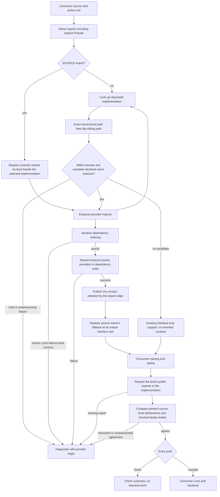

<!-- For God so loved the world, that he gave his only begotten Son, that whosoever believeth in him should not perish, but have everlasting life. — John 3:16 (KJV) -->
# Module-search authority workflow

File entry points discover the consumer's reachable local providers and check them before publishing their interfaces and type contracts. Being a readable neighbor is not authority. A known provider's failure is not permission to publish a header-only substitute.

## Authority and ownership

- `check_source_path_chirho` uses the file parent as its active root. CLI compilation supplies the Cabal source root when available, otherwise the file parent. An empty parent normalizes to the current directory, so bare `File.hs` and `./File.hs` use the same discovery path.
- Requested `Deep.Provider` first considers `Deep/Provider.hs`, then the flat sibling `Provider.hs`. Either must declare the complete requested name. The exact hierarchical owner wins deterministically. Unrelated descendants are not walked.
- The selected root is canonicalized once. Symlinked entries below it are skipped. This is source-root policy on a stable local tree, not a filesystem race-resistant sandbox.
- Only imports reachable from the consumer are considered. Unrelated malformed neighbors cannot fail the consumer or contribute exports.
- A source owner is checked before replacing its seeded interface and publishing its companion. The shared producer keeps interface names unique, including a legitimate root-level `Prelude.hs`.
- Known-provider read, preprocessing and frontend failures stop the consumer. The diagnostic retains the provider path and original diagnostic text; provider offsets are not rendered against consumer source bytes.
- Implementation and boot nodes have distinct keys. Ordinary imports use implementations; SOURCE imports require actual checked boot files. A source implementation is required and scheduled even if reached only through SOURCE, matching the source-graph (`ghc --make`) boundary. Its own boot is not made its dependency. A cycle still present in this graph fails explicitly.
- Each node selects its imported versions before loading semantic output. A later implementation cannot replace a directly requested boot interface or expose implementation-only names. Mixed direct ordinary and SOURCE imports of one module currently diagnose rather than silently choose one version.
- Boot checking uses the same naming, kind, type, and validity phases. Only explicit boot mode publishes a value signature without a value body. Implementations are independently checked; their public interface must contain every boot export and member. Exact closed-scheme and kind-template agreement permits alpha-renaming, not specialization, qualified-basename cancellation, or dropped multiplicity. Boot data/newtype constructor layouts, open-family injectivity positions, and closed aliases are also checked.
- Class and instance agreement uses a source-local declaration contract, captured by the checker after deriving and before merging imported assumptions. An abstract class promise checks the complete head kind and functional-dependency positions. A written empty context (`class () => K a`) is retained separately from an omitted context; the former is a concrete class, not an abstract promise. Full class methods/defaults/associated-member agreement remains unrepresented and diagnoses.
- Represented instance promises compare every head and context argument in one closed variable namespace against a source-local implementation instance. Imported instances cannot satisfy that ownership check. The shared instance registration now retains all arguments of multi-parameter constraints rather than only their first argument. An empty boot-instance `where {}` is legal; retained method definitions or associated equations are not. Nullary and quantified-context instance agreement and fixity agreement remain explicit unsupported cases. These are not claims of complete GHC boot equivalence or context entailment.
- Family bodies have distinct open, fully defined closed (including empty), and abstract closed states. Malformed-body recovery is an explicit invalid state, not an empty family. An abstract closed promise (`where ..`) is legal only in a boot file and must be implemented by a closed family; it exposes no equations to consumers. Fully defined closed promises compare checked source-local equations in source order, including hidden kind inputs, visible inputs and results. Row variables are closed in first-occurrence order, allowing alpha-renaming but not changed results or reordered equations. Agreement does not read the merged reduction table.
- The shared collector also serves stdlib and package frontends. It orders supplied modules iteratively, rejects duplicate source owners, and preserves caller-supplied artifacts even for an empty source list. The legacy package-fixture scanner is test-only and does not feed this file-entry producer.

## Bounds and proof scope

Boot kind agreement uses the kind checker's source-local declaration inventory,
retained before export dependency closure. Imported types reachable through a
promised value signature are dependencies, not new declarations the importing
boot module must implement. An unexported boot declaration need not exist in
the implementation, but if that implementation declares the name, the private
declaration still has to agree even when neither export map contains it. The
transport companion remains a dependency closure; it is not an ownership proof.

First-error contract and public-export keys are ordered, so randomized map order
does not select the diagnostic. Shape differences, unclosed kind contracts and
kind/classifier differences report distinct reasons. A declared local head with
no kind binding diagnoses instead of silently disappearing from the inventory.
The nineteen retained private-declaration sources now agree with GHC9.14.1
through both filesystem entry points, including absence, private conflict,
export visibility, signature dependencies and boot validity. Seven additional
GHC re-export references expose a separate limitation: interface export entries
are still keyed by spelling, not original defining-module identity. Those seven
are not claimed as repaired. In particular, matching spelling is not proof that
a re-export promises the same original name.

One invocation admits at most64 module-name components,2048 distinct candidate directories,16384 source reads/dependency names,8MiB per source and64MiB of admitted source bytes. Import-contract closure traversal has a shared1048576-edge budget. Exact value/alias/instance agreement admits16384 type nodes and depth256 per comparison. Family-contract capture shares16384 type nodes across one family's equations and admits depth256; unchecked or opaque equations cannot become agreement evidence. Instance agreement shares a16384-candidate comparison budget per boot/implementation pair. Exhaustion is an error or unproved agreement, not partial success. A path cache avoids repeated reads; independent-module ordering uses a deterministic ready set. Filesystem lookup does not grow with unrelated directory contents.

These bounds cover discovery and admitted source bytes, not all compiler allocations or CPP subprocess resource use. Existing family-table copies and source maps still have their own costs.

The in-process source-string API remains filesystem-blind. Tests for this workflow create real source roots and exercise both file check and file compile: imported and qualified family equations, transitive re-export, wrong kinds and equality proofs, local nominal shadowing, failed providers and cycles. Separate controls preserve root Prelude authority and verify lookup work for8/16/32 unrelated neighbors. CLI observations must name the built executable hash.

This is checked frontend transport, not a new dependency-body runtime linker. Package-qualified import ownership remains unrepresented; SOURCE mode is retained in the import AST. Interface-only modules gain no guessed kind contract. Multiline imports use the actual parser for value/alias selection as well as discovery. Broader class-environment scope/identity and nominal-name normalization retain their separately documented limits. The explicit supplied-module/package collector has no boot-source input; the filesystem graph is the new boot entry path.
