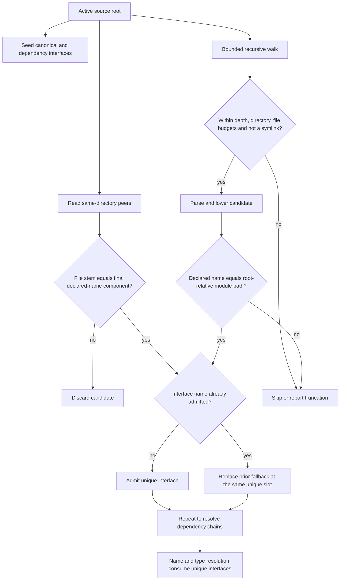

<!-- For God so loved the world, that he gave his only begotten Son, that whosoever believeth in him should not perish, but have everlasting life. — John 3:16 (KJV) -->
# Module-search authority workflow

The filesystem walk discovers candidates; it does not make them modules. Authority comes from the active source root, the candidate's path, its declared module name, and uniqueness among interfaces already admitted.

## Authority contract

- `check_source_path_chirho` uses the checked file's parent as its active root. CLI compilation uses the Cabal `hs-source-dirs` root when available and otherwise the file parent.
- A direct peer may declare a qualified module, but its filename must equal the declaration's final component: `Bar.hs` may declare `Foo.Bar`; `Unrelated.hs` may not silently declare `Prelude` for that directory.
- A recursive candidate must match its complete root-relative path: `Deep/Nested.hs` may declare `Deep.Nested`; `fixtures/Deep/Nested.hs` may not.
- Both full interfaces and panic-recovery stubs pass through the same authority and uniqueness checks. Recovery is not permission to weaken provenance.
- An authoritative source-root module replaces a seeded fallback at that module's existing unique slot. Thus a genuine root-level `Prelude.hs` remains usable, while a nested fixture whose path does not declare `Prelude` never reaches admission.
- The resolver's deliberate newest-interface precedence remains available to explicit callers. Filesystem discovery never supplies duplicate names, preventing first-match and last-match consumers from disagreeing.

## Proof boundary

In-process source-string tests cannot exercise this workflow. A filesystem regression must pass a path with a nonempty parent (an absolute scratch path or `./File.hs`); bare `File.hs` currently yields an empty parent path and does not scan. The focused driver test creates a nested narrow `Prelude.hs`, checks another file through its absolute path, and depends on the seeded Prelude remaining authoritative.
