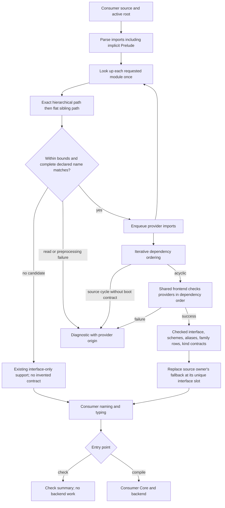

<!-- For God so loved the world, that he gave his only begotten Son, that whosoever believeth in him should not perish, but have everlasting life. — John 3:16 (KJV) -->
# Module-search authority workflow

File entry points discover the consumer's reachable local providers and check them before publishing their interfaces and type contracts. Being a readable neighbor is not authority. A known provider's failure is not permission to publish a header-only substitute.

## Authority and ownership

- `check_source_path_chirho` uses the file parent as its active root. CLI compilation supplies the Cabal source root when available, otherwise the file parent. An empty parent normalizes to the current directory, so bare `File.hs` and `./File.hs` use the same discovery path.
- Requested `Deep.Provider` first considers `Deep/Provider.hs`, then the flat sibling `Provider.hs`. Either must declare the complete requested name. The exact hierarchical owner wins deterministically. Unrelated descendants are not walked.
- The selected root is canonicalized once. Symlinked entries below it are skipped. This is source-root policy on a stable local tree, not a filesystem race-resistant sandbox.
- Only imports reachable from the consumer are considered. Unrelated malformed neighbors cannot fail the consumer or contribute exports.
- A source owner is checked before replacing its seeded interface and publishing its companion. The shared producer keeps interface names unique, including a legitimate root-level `Prelude.hs`.
- Known-provider read, preprocessing and frontend failures stop the consumer. The diagnostic retains the provider path and original diagnostic text; provider offsets are not rendered against consumer source bytes.
- Source cycles without checked boot input fail explicitly. This producer does not fake a sequentially checked SCC or infer an hs-boot contract.
- The shared collector also serves stdlib and package frontends. It orders supplied modules iteratively, rejects duplicate source owners, and preserves caller-supplied artifacts even for an empty source list. The legacy package-fixture scanner is test-only and does not feed this file-entry producer.

## Bounds and proof scope

One invocation admits at most64 module-name components,2048 distinct candidate directories,16384 source reads/dependency names,8MiB per source and64MiB of admitted source bytes. Exhaustion is an error, not a partial-success warning. A path cache avoids repeated reads; independent-module ordering uses a deterministic ready set. Filesystem lookup does not grow with unrelated directory contents.

These bounds cover discovery and admitted source bytes, not all compiler allocations or CPP subprocess resource use. Existing family-table copies and source maps still have their own costs.

The in-process source-string API remains filesystem-blind. Tests for this workflow create real source roots and exercise both file check and file compile: imported and qualified family equations, transitive re-export, wrong kinds and equality proofs, local nominal shadowing, failed providers and cycles. Separate controls preserve root Prelude authority and verify lookup work for8/16/32 unrelated neighbors. CLI observations must name the built executable hash.

This is checked frontend transport, not a new dependency-body runtime linker. Package-qualified imports and SOURCE/hs-boot distinctions are not retained in the current import AST and are not newly implemented by this producer. Interface-only modules gain no guessed kind contract. Existing import visibility filtering and nominal-name normalization retain their separately documented limits.
