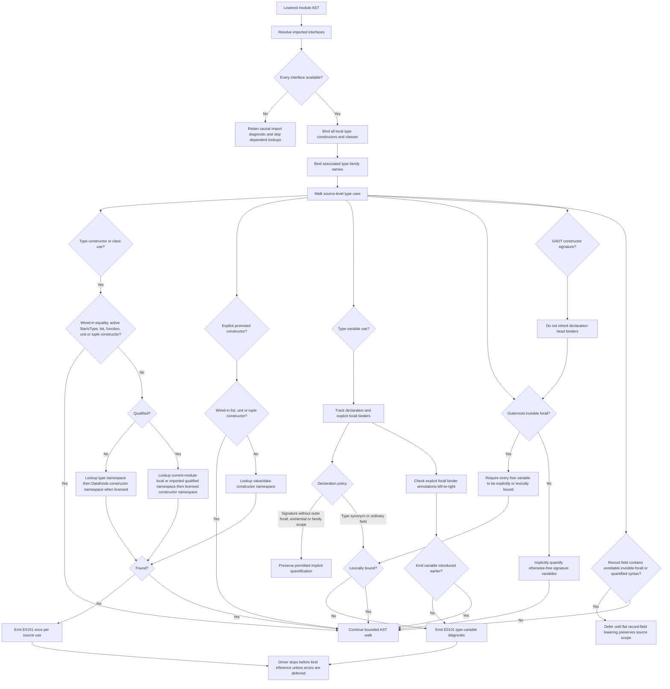

<!-- For God so loved the world, that he gave his only begotten Son, that whosoever believeth in him should not perish, but have everlasting life. — John 3:16 (KJV) -->
# Type-scope resolution workflow

This workflow is owned by `resolve_module_with_imports_chirho` and `check_module_type_scope_chirho`. It runs after imports and all module-local type definitions have populated `NameEnvChirho`, but before kind and type inference.

The walker performs no filesystem lookup or module scanning. Its successful-resolution path is linear in the lowered AST with hash-backed namespace lookups; the error-only suggestion path compares against the already-populated in-memory environment, and duplicate diagnostics are suppressed by issue/name/span. The record-field deferral is an AST trust boundary for the open `bug-record-field-forall-lowering-chirho.md`; ordinary and required-forall record fields remain covered, and the branch can disappear when that parser fix lands.
