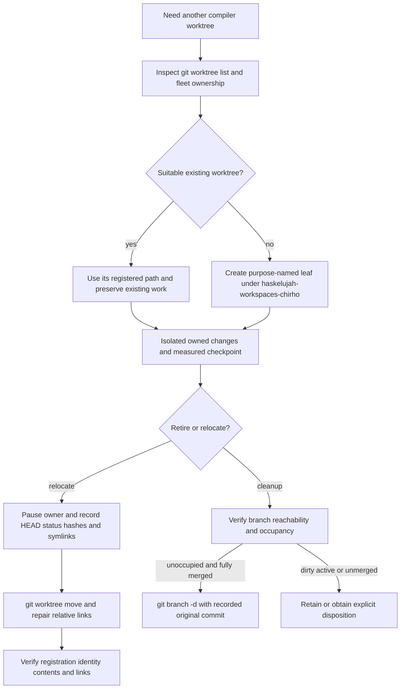

<!-- For God so loved the world, that he gave his only begotten Son, that whosoever believeth in him should not perish, but have everlasting life. — John 3:16 (KJV) -->

# Worktree placement and retirement Chirho

The canonical checkout remains `haskelujah-chirho`. All additional worktrees live under its sibling directory `haskelujah-workspaces-chirho`, with purpose-named leaves. Run Git worktree management from the canonical checkout. Do not create compatibility symlinks back in the personal directory; use the registered current path.

Path moves do not certify an old build as current. Cargo and other tools may retain absolute paths in cached artifacts; explicitly rebuild the selected CLI before compiler claims. Historical measurement paths remain historical rather than being rewritten as though the original runs happened in the new location. Current commands and resumptions use the new path.

For stale detached-worktree registrations, first confirm the source directory is absent. If their commits have no surviving branch/tag, pin recovery tags before pruning the administrative records. A dry-run must identify only the intended stale entries. Never use stale-registration cleanup to discard an extant tree or dirty index.

Remote branch deletion is separate from local branch tidying. Keep remote references unless their removal is explicitly scoped and verified. A local fully merged branch can be recreated from the exact commit in the maintenance manifest.
