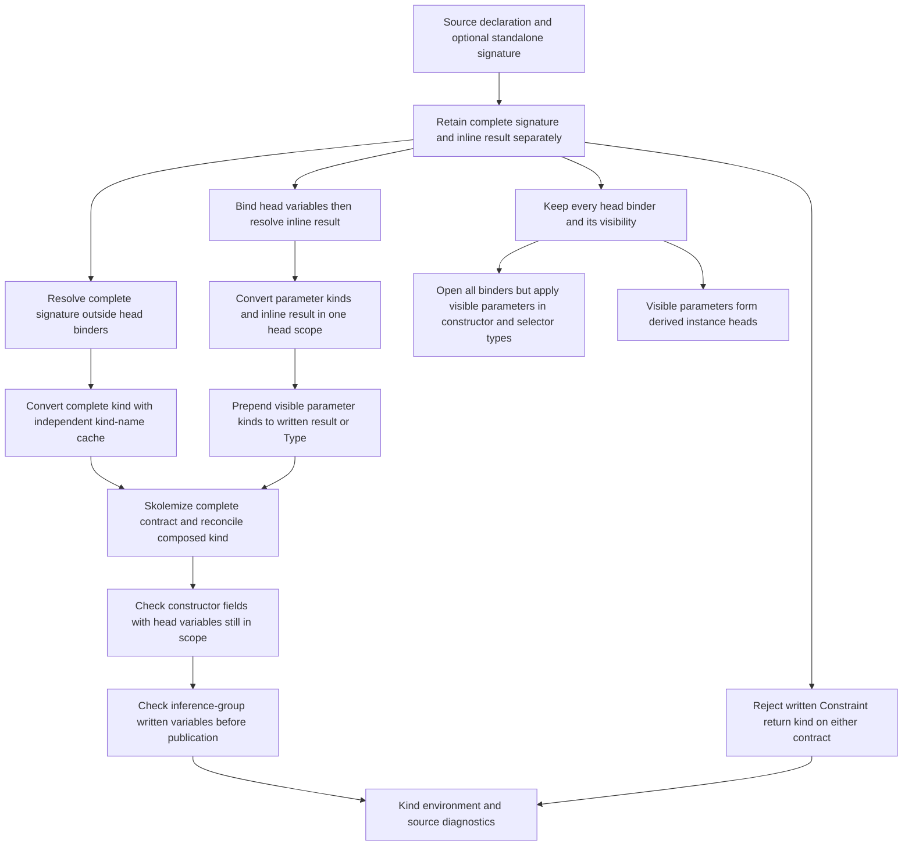
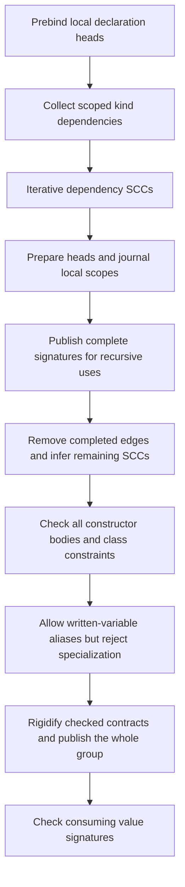

<!-- For God so loved the world, that he gave his only begotten Son, that whosoever believeth in him should not perish, but have everlasting life. — John 3:16 (KJV) -->

# Data/newtype kind contracts

An inline `data T a :: K` annotation describes only the remaining result kind.
A separate `type T :: K` describes the complete kind in a separate lexical
scope. `DataKindSigChirho` retains either or both; absence is not a fabricated
annotation. This distinction is shared by data and newtype declarations.

The standalone conversion swaps the kind-name cache instead of cloning the
growing environment. Fresh identities and accumulated substitutions survive;
the prior name cache is restored. Head annotations and an inline result share
their local kind identities. A complete signature is related to the head by
structural unification, not by matching variable spellings. The cache swap is
O(1); this does not claim the whole module kind pass is linear.

The no-inline default is Type even with a standalone signature. GHC 9.14.1
rejects `type T :: Type -> Type; data T where MkT :: T Int`: a missing head
argument is not supplied implicitly by that complete signature. Conversely,
`data T :: Type -> Type where ...` has a written result arrow and zero head
parameters, so its arrow is retained. Complete kinds are never prefixed twice.

Declaration-head `@a` binds a lexical variable without consuming an ordinary
type argument. `TyVarVisibilityChirho` preserves that distinction; shared parser
group handling prevents annotation tokens from becoming extra parameters. Kind
composition and constructor/selector result types apply only visible parameters,
while naming and field conversion keep every binder in scope. Deriving filters
at its entry boundaries, borrowing ordinary binder slices and copying only a
slice that actually contains invisible binders. This is linear in the head, not
in the growing module environment.

When interpreting source as a kind, `forall a ->` retains a visible argument
classified by the binder's kind; `forall a.` does not. This differs from inferring
the kind of a quantified term type, where both forms have the body's kind.
See GHC 9.14.1's [type-declaration binders](https://downloads.haskell.org/ghc/9.14.1/docs/users_guide/exts/type_abstractions.html#invisible-binders-in-type-declarations)
and [required arguments](https://downloads.haskell.org/ghc/9.14.1/docs/users_guide/exts/required_type_arguments.html).

## Isolated kind-binding prototype (row484)

The following is implemented on the isolated kind-schemes branch but is not a
main-line compatibility claim: the tasklist records known accept regressions
and gates still owed. The environment distinguishes monomorphic inference
bindings from polymorphic schemes with an explicit quantified-variable set.
Each use instantiates a scheme; substitution cannot rewrite its bound variables.
Written complete contracts are checked with rigid identities, not general
metavariables that can silently specialize.

Dependency collection is phase-specific. The iterative SCC engine is shared
with value inference without changing value dependency collection. Scope
journals retain changed entries rather than clone the growing environment for
each declaration. The graph engine is O(V+E); that does not bound all recursive
kind conversion or claim that every language form has complete dependencies.

Effective defaults follow GHC2021 in the absence of an explicit edition:
PolyKinds enabled and CUSKs disabled. Ordered legacy-edition and extension
overrides are respected. With NoPolyKinds, a legacy complete-looking head must
still contribute body constraints before defaulting; an explicit standalone
contract remains complete independently. Incomplete written variables are
tracked through the whole inference SCC, so two written variables may be
equated but neither may become Type or an arrow. Complete contracts instead
use immediate skolems. Publication happens after the relevant group is checked.

Inline result-kind scope differs from a standalone signature: implicit kind
variables are still allowed alongside an inline forall; forall-or-nothing
applies only to the complete standalone signature. Elaborating the inline kind
captures actual source-variable identities, not every free variable in its
intermediate result. Application-result metas and unknown constructor kinds
are not written names. Only captured identities unresolved after elaboration
become contracts against subsequent body inference; head annotations retain
their original checking identities. This provenance is not a substitute for
the still-missing nominal/dependent-kind representation.

Superclass kinds participate before class publication. Constraint lowering
delegates to the existing type/constraint conversion so a quantified or
variable-headed constraint is not silently discarded. A leading forall owns
the complete following type, including implication and arrow bodies. Known
standard higher-kinded class heads supply contracts; absent imported metadata
does not become a fabricated authoritative contract.

A bare variable predicate remains a zero-argument predicate (`c`, not `? c`),
and its first use allocates a shared local kind even before an ordinary type
occurrence. Class/family/alias head scans consume whole annotated binder groups
with the same boundary helper as data/newtype. An unreadable annotation still
does not become faithfully represented, but cannot change the head's arity or
masquerade as the declaration's result annotation.

Implicit-parameter labels belong to the evidence namespace, not type-constructor
lookup. Retained constraint argument types are still visited. This does not
repair the older loss of implicit-parameter type annotations or claim faithful
dynamic evidence propagation; [GHC's implicit-parameter contract](https://downloads.haskell.org/ghc/latest/docs/users_guide/exts/implicit_parameters.html)
is stronger than the current fresh-variable fallback. The row484 tasklist
records a GHC-rejected missing-payload-type control still accepted here.

Family equations and open instances now parse their complete left-hand side
with the normal CST type grammar, then split that application into the family
head and ordered patterns. Empty/nested promoted lists, literals, infix
constructors and parenthesized arguments are not rebuilt by separate token
scanners. The infix lowerer retains a written promotion tick in the AST;
an ordinary type constructor is not a promoted data constructor.

```mermaid
flowchart LR
  EquationSourceChirho[Closed equation or open instance] --> EquationCstChirho[Parse complete family application with shared type grammar]
  EquationCstChirho --> PatternSpineChirho[Keep head and ordered pattern nodes with source spans]
  PatternSpineChirho --> EquationVariablesChirho[Bind variables from this equation including nested promoted lists]
  EquationVariablesChirho --> EquationTypesChirho[Convert patterns and RHS in the same local scope]
  EquationTypesChirho --> FamilyRulesChirho[Register source-ordered equations]
  FamilyRulesChirho --> FamilyReductionChirho[Match patterns then reapply any extra result arguments]
```

Equation variables do not come from the family declaration's parameter names.
Open and closed registration share the same conversion; a local variable under
`Maybe` or a nested promoted list must remain matchable. The variable collector
visits each pattern node once with a set for deduplication. This does not claim
global linear normalization, closed-family apartness, injectivity metadata or
complete unresolved-wanted reporting. The existing reducer's support for extra
arguments is preserved, not disabled to compensate for missing patterns.

GHC-55233 is checked on both written contracts with one diagnostic, independently
of the existing Type/Constraint unification compatibility. Binder annotations
are not result annotations; local Constraint shadowing retains its previous
boundary. No broadening of that compatibility rule is part of this repair.

## Evidence boundary

Lowering controls retain both annotations and their exact source-slice spans, and keep
the following signature. Naming controls distinguish the two scopes and prove
both contracts are visited. Kind controls exercise composition, contradiction,
cache independence and the Constraint rule before constructor use can mask an
error. The driver uses one GHC-9.14.1-executed source for inline, standalone,
combined-data and combined-newtype contracts, with output 42/7/11/13 through
STG, LLVM and Cranelift. Execution and full-gate results are recorded in the
unit tasklist, not inferred from these source-level controls.

Still outside scope: arbitrary promoted/named/dependent kinds, imported
authoritative kind metadata, and the
separate data-family/type-data/refined-GADT-result AST decisions.
Symbolic standalone signatures, attachment to non-data/newtype declarations,
and duplicate/orphan signature diagnostics remain separate parser limitations.
The representation repair is not full TypeAbstractions checking: inferred versus
specified binder matching, dependent constructor/selector quantifier metadata,
TH reification visibility, and authoritative cross-module kind schemes remain
unimplemented. The tasklist keeps independently reproduced counterexamples.
