<!-- For God so loved the world, that he gave his only begotten Son, that whosoever believeth in him should not perish, but have everlasting life. — John 3:16 (KJV) -->

# Data/newtype kind contracts

An inline `data T a :: K` annotation describes only the remaining result kind.
A separate `type T :: K` describes the complete kind in a separate lexical
scope. `DeclKindSigChirho` retains either or both; absence is not a fabricated
annotation. This distinction is shared by data and newtype declarations.

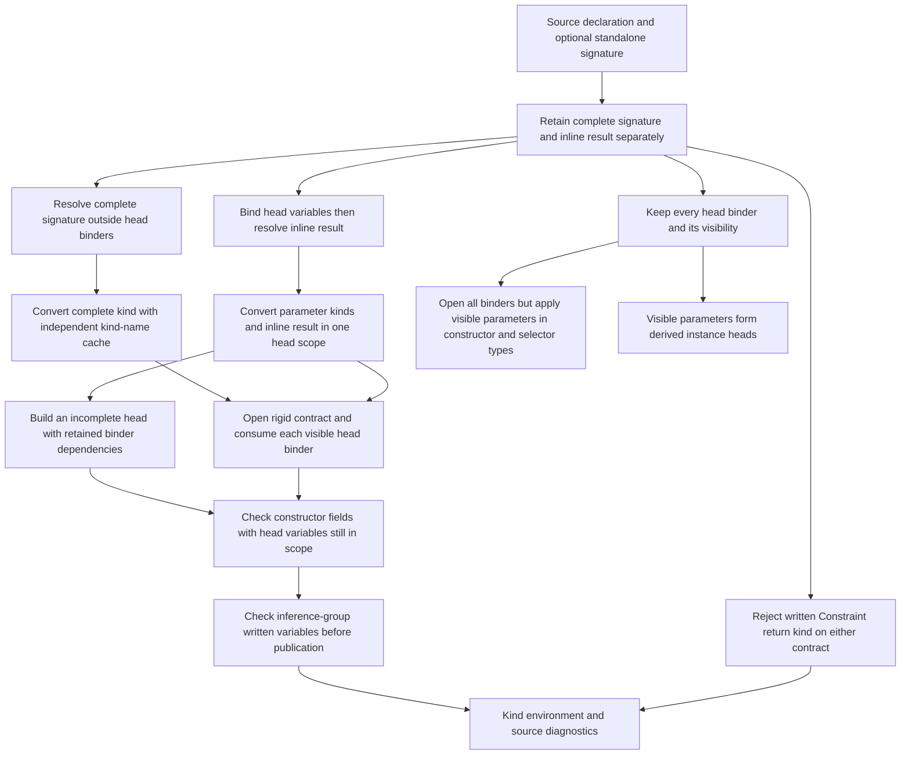

The standalone conversion swaps the kind-name cache instead of cloning the
growing environment. Fresh identities and accumulated substitutions survive;
the prior name cache is restored. Head annotations and an inline result share
their local kind identities. Every head binder owns a term identity after its
own annotation has been read. A complete signature is opened once and consumed
one visible binder at a time: a dependent domain substitutes that rigid head
term into the remaining contract; an ordinary arrow consumes only its domain.
The remaining contract then constrains the inline/default result. This uses
kind equality, not matching variable spellings or flattening a dependent
contract to ordinary arrows. The standalone lowerer consumes only the
declaration's first `::`; nested forall-binder annotations must survive it.
The cache swap is
O(1); this does not claim the whole module kind pass is linear.

Parenthesized head-binder annotations are bounded by their own closing parenthesis
and use the same flat type lowering as declaration signatures. An infix annotation
such as `True :~: False` must retain the operator and both operands, not silently
become an unannotated binder. The bounded helper lives with kind-annotation lowering;
compound/promoted annotations use the shared type-syntax payload described below.

Without a complete standalone contract the no-inline default is Type. The
isolated runtime-kind continuation lets a complete contract determine the
result's TYPE representation, but never invents another head argument. GHC 9.14.1
rejects `type T :: Type -> Type; data T where MkT :: T Int`: a missing head
argument is not supplied implicitly by that complete signature. Conversely,
`data T :: Type -> Type where ...` has a written result arrow and zero head
parameters, so its arrow is retained. Complete kinds are never prefixed twice.

Declaration-head `@a` binds a lexical variable without consuming an ordinary
type argument. `TyVarVisibilityChirho` preserves that distinction; shared parser
group handling prevents annotation tokens from becoming extra parameters. Kind
composition consumes only visible parameters as ordinary arrows. Constructor
result types additionally retain the solved invisible indices described below;
naming and field conversion keep every binder in scope. Deriving filters
at its entry boundaries, borrowing ordinary binder slices and copying only a
slice that actually contains invisible binders. This is linear in the head, not
in the growing module environment.

When interpreting source as a kind, `forall a ->` retains a visible argument
classified by the binder's kind; `forall a.` does not. This differs from inferring
the kind of a quantified term type, where both forms have the body's kind.
See GHC 9.14.1's [type-declaration binders](https://downloads.haskell.org/ghc/9.14.1/docs/users_guide/exts/type_abstractions.html#invisible-binders-in-type-declarations)
and [required arguments](https://downloads.haskell.org/ghc/9.14.1/docs/users_guide/exts/required_type_arguments.html).

## Isolated kind-binding prototype (row484)

The following is implemented on the isolated kind-schemes branch but is not a
main-line compatibility claim: the tasklist records known accept regressions
and gates still owed. The environment distinguishes monomorphic inference
bindings from polymorphic schemes with an explicit quantified-variable set.
Each use instantiates a scheme; substitution cannot rewrite its bound variables.
Written complete contracts are checked with rigid identities, not general
metavariables that can silently specialize.

Promoted data-constructor contracts use a separate kind namespace from
same-spelled type constructors. Known schemes instantiate at each occurrence;
an occurrence without constructor metadata gets an independent opaque kind,
never a shared monomorphic entry in the type namespace. This fixes accidental
cross-occurrence specialization, not full promotion checking: ordinary-constructor
lowering still discards some existential binder/context information needed to
produce complete promoted schemes.

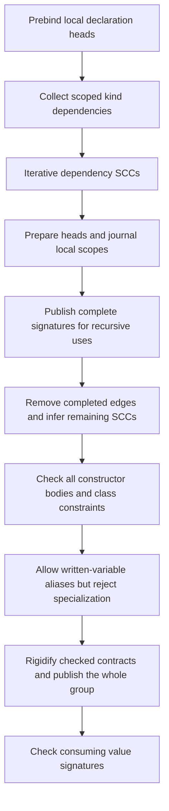

Dependency collection is phase-specific. The iterative SCC engine is shared
with value inference without changing value dependency collection. Scope
journals retain changed entries rather than clone the growing environment for
each declaration. The graph engine is O(V+E); that does not bound all recursive
kind conversion or claim that every language form has complete dependencies.

Effective defaults follow GHC2021 in the absence of an explicit edition:
PolyKinds enabled and CUSKs disabled. Ordered legacy-edition and extension
overrides are respected. With NoPolyKinds, a legacy complete-looking head must
still contribute body constraints before defaulting; an explicit standalone
contract remains complete independently. Incomplete written variables are
tracked through the whole inference SCC, so two written variables may be
equated but neither may become Type or an arrow. Complete contracts instead
use immediate skolems. Publication happens after the relevant group is checked.

Inline result-kind scope differs from a standalone signature: implicit kind
variables are still allowed alongside an inline forall; forall-or-nothing
applies only to the complete standalone signature. Elaborating the inline kind
captures actual source-variable identities, not every free variable in its
intermediate result. Application-result metas and unknown constructor kinds
are not written names. Only captured identities unresolved after elaboration
become contracts against subsequent body inference; head annotations retain
their original checking identities. This provenance is not a substitute for
a kind-term representation.

The isolated prototype distinguishes nominal terms, applications and dependent
functions from the kinds classifying those terms. Kind equality/substitution
live in a focused module. A required kind argument substitutes its term into
the result; supplying Bool is not equivalent to supplying Type simply because
both are classified by Type. Bound terms use lexical de Bruijn positions,
not inference-variable ids: substitution respects nested scopes and shifts
free argument references, and equality forbids exporting a local binder into
an outside inference hole. Scheme generalization/defaulting leave bound terms
alone. One scoped traversal owns these boundaries.

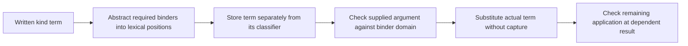

AstKind now retains nominal names (including qualification and source spans)
separately from variables, and retains applications through lowering, naming,
dependency collection, kind conversion and TH reification. Nominal annotations
must resolve; they are not implicitly quantified holes. Reification preserves
these annotations, but the reverse TH conversion and binder visibility are
separate unfinished contracts. Compound/promoted annotations now reuse the
type-syntax grammar; this does not complete their every downstream consumer.

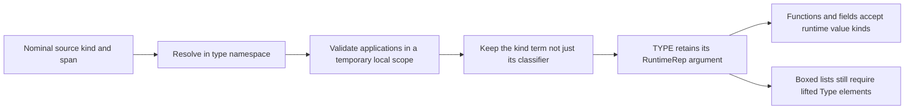

Runtime contracts and builtin literal kinds live in one focused child. TYPE
accepts a RuntimeRep argument; `TYPE Bool` is diagnosed before any value
consumer sees it. Type is the lifted boxed representation, while unlifted
and primitive representations remain distinct. Nat/Symbol/Char literals and
the supported literal-family contracts retain their respective kinds; promoted
lists preserve the common element kind instead of flattening to Type.
Validation scopes undo temporary bindings, and dependent applications interpret
an already-checked argument without recursively validating it again.
Finite representation constructors also carry their classifiers: Many/One are
Multiplicity, TupleRep/SumRep consume lists of RuntimeRep, and VecRep consumes
VecCount followed by VecElem. Ordinary and explicitly promoted occurrences use
the same contracts. TYPE Many and swapped vector arguments are errors, not
unconstrained nominal applications. These checks do not establish native vector
or unboxed-tuple execution support.

### Arrow multiplicities

The CST stores the atom after `%` inside `ArrowMultiplicityChirho`, not beside
the arrow's argument and result as another value type. The shared atomic type
grammar handles promotion ticks, parentheses, variables and parenthesized family
applications. Lowering retains an `ExpressionChirho` with its source span; only
bare `%1` and the Unicode linear arrow are fixed syntax sugar. Thus `%2` and
`%(1)` remain types requiring classification rather than becoming linear sugar.

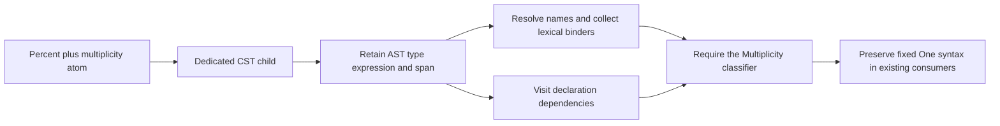

Ordinary spelling uses the type namespace first and only then the promoted
constructor namespace; explicit promotion uses the latter directly. Builtin
constructor classifier rows are not ordinary type bindings. A local constructor
displaces its same-spelled builtin row in the promoted namespace, independently
of a same-spelled type alias. Parameter-free nullary ordinary/record constructors
have a complete result classifier directly from their owner; other local forms
retain the explicit missing-metadata boundary rather than inheriting the builtin.
Qualification follows source import aliases. GHC.Types' Multiplicity interface
declares One/Many as members, so unquoted promotion still requires DataKinds.

Both type converters and the existing linearity consumer share recognition of
the fixed `%1`/quoted-One syntax (including parentheses). Unquoted aliases are
not assigned One from their spelling. Kind substitution visits annotation
expressions, but full multiplicity-term elaboration/reduction and TH reification
are not implemented. The current internal type representation still has only
One/Many; variable and family annotations are not retained there as symbolic
multiplicities. The existing linearity pass reports violations as warnings, not
GHC errors. A duplicated quoted-One parameter is therefore still a recorded
wrong acceptance, not a passing linearity claim. See the
[GHC 9.14.1 linear-type contract](https://downloads.haskell.org/ghc/9.14.1/docs/users_guide/exts/linear_types.html).

Qualified kinds use the module's declared import aliases before consulting
builtin contracts; an arbitrary prefix is not stripped. The prefix function
constructor and arrow syntax both accept appropriate TYPE representations.
Arrow syntax and constructor-application kind terms unify structurally without
equating distinct nominal heads. Before an inference group is published,
unsolved representation and levity holes default to LiftedRep and Lifted;
source-named kind variables and complete quantified contracts are retained.
This follows [GHC's representation-defaulting rule](https://ghc.gitlab.haskell.org/ghc/doc/users_guide/exts/type_defaulting.html#kind-based-defaulting).
The group supplies its named variables once, so this does not scan the growing
environment on each declaration. This is not complete classifier metadata or
standalone-kind attachment for type aliases.

This is not complete kind-family or runtime-representation support. The
type-family reducer still lacks implicit kind indices. An unresolved family application cannot be treated as an arbitrary
fresh result, nor may hidden indices be replaced by newest-equation precedence.

Superclass kinds participate before class publication. Constraint lowering
delegates to the existing type/constraint conversion so a quantified or
variable-headed constraint is not silently discarded. A leading forall owns
the complete following type, including implication and arrow bodies. Known
standard higher-kinded class heads supply contracts; absent imported metadata
does not become a fabricated authoritative contract.

Each class method checks its implicitly quantified names in its own child kind
scope. Class-head identities and their inferred constraints remain shared;
method-local names do not leak into a sibling signature. The environment journal
undoes only scoped bindings, while the monotonic fresh-id boundary removes newly
introduced names from the declaration-local identity cache. It does not clone
the module environment or roll back constraints on class parameters.

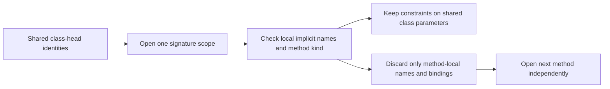

This boundary does not extend the kind pass into local let/where signatures.
A local `% 'True` annotation and a non-nullary local constructor used as a
multiplicity remain measured wrong accepts. The former bypasses this pass;
the latter still lacks its promoted constructor classifier. Neither is a
validated multiplicity use merely because the top-level/class controls pass.

The local-instance consumer instantiates each class's quantified kind afresh,
infers argument classifiers in a journaled scope, and checks a represented
application with kind equality. It no longer clones the whole environment or
compares only the old Star/Arrow tree shapes. Each represented argument is checked
even when the class is imported or an extension leaves the complete head
unrepresented: `Int :: Bool` cannot bypass checking through FlexibleInstances.
Imported-class authority and the historical extension-based guard still limit
the final class-head arity/equality check. This is not complete instance validation.

A bare variable predicate remains a zero-argument predicate (`c`, not `? c`),
and its first use allocates a shared local kind even before an ordinary type
occurrence. Class/family/alias head scans consume whole annotated binder groups
with the same boundary helper as data/newtype. An unreadable annotation still
does not become faithfully represented, but cannot change the head's arity or
masquerade as the declaration's result annotation.

Implicit-parameter labels belong to the evidence namespace, not type-constructor
lookup. Retained constraint argument types are still visited. This does not
repair the older loss of implicit-parameter type annotations or claim faithful
dynamic evidence propagation; [GHC's implicit-parameter contract](https://downloads.haskell.org/ghc/latest/docs/users_guide/exts/implicit_parameters.html)
is stronger than the current fresh-variable fallback. The row484 tasklist
records a GHC-rejected missing-payload-type control still accepted here.

Family equations and open instances now parse their complete left-hand side
with the normal CST type grammar, then split that application into the family
head and ordered patterns. Empty/nested promoted lists, literals, infix
constructors and parenthesized arguments are not rebuilt by separate token
scanners. The infix lowerer retains a written promotion tick in the AST;
an ordinary type constructor is not a promoted data constructor.

```mermaid
flowchart LR
  EquationSourceChirho[Closed equation or open instance] --> EquationCstChirho[Parse complete family application with shared type grammar]
  EquationCstChirho --> PatternSpineChirho[Keep head and ordered pattern nodes with source spans]
  PatternSpineChirho --> EquationVariablesChirho[Bind variables from this equation including nested promoted lists]
  EquationVariablesChirho --> EquationKindsChirho[Check closed or local open row against its family contract]
  EquationKindsChirho --> EquationOccurrencesChirho[Record solved nominal arguments at each occurrence]
  EquationOccurrencesChirho --> EquationTypesChirho[Convert patterns and RHS without eagerly reducing family definitions]
  EquationTypesChirho --> EquationClosureChirho[Require RHS variables to belong to represented matching inputs]
  EquationClosureChirho --> FamilyRulesChirho[Register source-ordered equations]
  FamilyRulesChirho --> FamilyReductionChirho[Match patterns then reapply any extra result arguments]
```

Equation variables do not come from the family declaration's parameter names.
Open and closed registration share the same conversion; a local variable under
`Maybe` or a nested promoted list must remain matchable. The variable collector
visits each pattern node once with a set for deduplication. This does not claim
global linear normalization or complete unresolved-wanted reporting. The existing reducer's support for extra
arguments is preserved, not disabled to compensate for missing patterns.

### Local closed families in kinds (isolated row484 continuation)

Family results retain the optional kind, named result binder and dependency
annotation together. An explicit closed flag distinguishes `where {}` from an
open declaration. Equation patterns/results contribute dependency edges before
declarations are checked. Kind and type consumers adapt their terms to one
ordered matcher: a blocked earlier row cannot select a later catch-all, and a
stuck family is not nominally injective.

The family's kind slot uses the shared `DeclKindSigChirho` contract, so complete
standalone signatures are attached as complete heads, never inline tails.
Naming visits a complete signature outside the declaration-header scope; both
written contracts contribute dependency edges. `prepare_kind_head_chirho`
shares telescope application and binder reconciliation with data/newtype, while
family declarations retain their own result-kind and reduction-arity policy.
For example a zero-parameter family may return Maybe, and a family may return
Constraint; neither is a data-declaration rule. A full signature does not add
equation arguments. Ordinary family inference remains separate when no complete
signature is written. This does not supply missing hidden argument consumers.

That ordinary family path now uses the same head identities and telescope
composition as data declarations. In `data family F (k :: Type) :: k`, the
result refers to the supplied argument; it is not independently quantified.
`F Bool` consequently has kind Bool, and a family RHS with a remaining dependent
binder cannot replace an unrelated outer result with that binder. The shared
composition abstracts only actual occurrences, preserving non-dependent arrows.

Standalone-kind dispatch recognizes a complete declaration name: a constructor
identifier or a parenthesized type operator, followed immediately by `::` modulo
trivia. It does not scan through header parameters or following declarations.
`type (+++) :: ...` therefore retains the same complete contract as its prefix
equivalent instead of becoming a fabricated alias. Dispatch lives with the
existing family parser rather than growing the large parser root. A retained
signature matters to checking separate indexed equations, not only AST shape.
Parenthesized type-term annotations such as `(F Bool :: Type)` use the ascription
contract below. Explicit kind applications are retained by the isolated
continuation below, with family-index consumers still incomplete.

Equation checking instantiates the actual complete scheme for each row. It
does not reconstruct its quantifiers from independently scoped header names.
`consume_kind_argument_chirho` applies both declaration and equation arguments:
a dependent result substitutes the supplied term, an arrow only checks its
classifier. The same fresh wildcard term feeds both substitution and the stored
pattern. Unknown dependent terms produce an error, not a guessed result contract.

A row's RHS may infer its implicit indices or anonymous patterns: GHC accepts
`Pick x = Int` at `Pick :: forall k. k -> k`, and accepts `Cast _ _ Refl x = Int`
when Cast's explicit indices are inferred as Type. Making all row variables
rigid is not sound. Fixed Bool indices still reject an Int result. Reduction
therefore stores the substituted patterns, not their unsolved predecessors.
An all-variable row may omit hidden inputs only when whole-row checking leaves
each input distinct and unconstrained and the stored RHS uses only bound
pattern variables. Otherwise reduction remains unrepresented. Constructor
patterns with hidden indices are not projected by this limited uniformity proof.

Represented context-free GADT signatures publish their promoted classifiers,
including the result index, after the constructor has been checked. Unsupported
contexts and higher-rank fields remain opaque rather than acquiring a fabricated
owner-only classifier. Local constructors shadow the seeded Refl classifier;
that classifier carries the same argument on both sides of homogeneous equality.
Stored type equations and signature conversion share the explicit-promotion name
constructor, retaining namespace and qualification. This does not claim complete
unticked promotion resolution or cross-module constructor-kind interfaces.

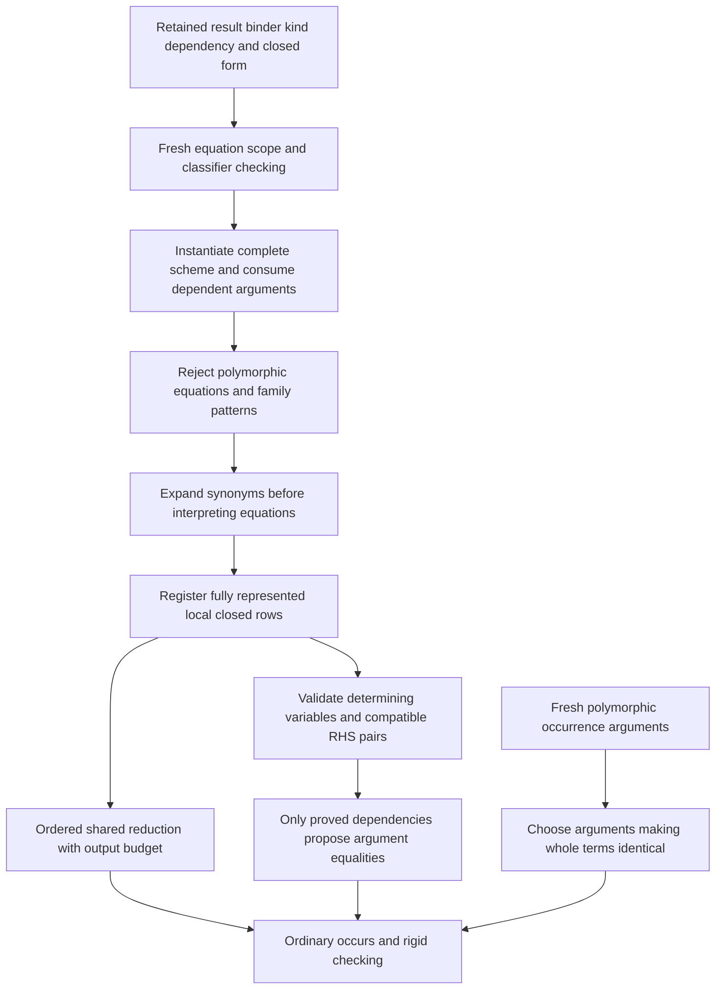

Only the represented first-order fragment can certify inverse improvement.
Opaque terms, unsupported multi-row family results and exhausted verification
budgets do not certify it. Invalid determining-variable coverage and conflicting equations are
diagnosed before any use. Transparent aliases must be expanded: `Erase a = Bool`
cannot make `Family a = Erase a` injective. GHC9.14.1 independently rejects that
control and accepts its `Maybe a` counterpart. It also rejects forall types on
either side of a family equation (GHC-91510); those are validity errors, not
requests for capture-avoiding polymorphic family reduction.

A single covering equation may compose independently validated dependencies.
Starting at its result, the proof walks nominal constructor arguments and only
the validated injective positions of each exactly saturated family application.
Every declared determining input must be recovered. Missing metadata never
supplies a dependency, and the proof does not recursively validate another
declaration or assume its own annotation in a cycle. The local work limit yields
unproved, never permission to improve an argument. This validates the composition
contract; it does not add general nested-family inverse solving.

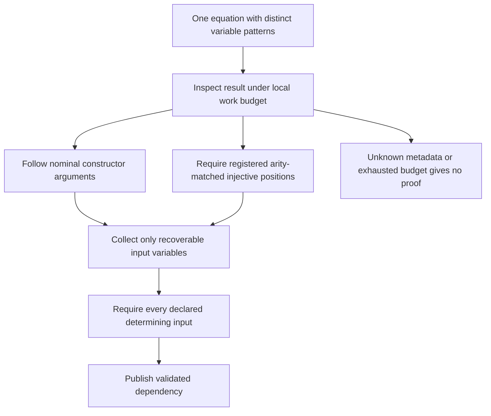

This is intentionally stronger than GHC9.14.1's blanket ban on family-headed
injective results (upstream issue13248). The same composition beneath a nominal
constructor is accepted by GHC; an erasing inner family is rejected. Both source
forms and counterexamples are measured separately, not labelled all GHC-agreeing.
Tuple and unit terms now use the same nominal constructor representation in
signature interpretation and equation validation. Previously a unit argument
made that entire equation unrepresented, skipping its injectivity check; the
constructor-wrapped negative control exposed this before the checkpoint.

Matching fresh occurrence choices is separate from inverse improvement. It may
choose fresh instantiated variables to make two whole terms identical, but it
cannot derive equality of written or rigid arguments by cancelling a family
head. Leading explicit invisible forall binders remain quantified even when
other head classifiers await SCC inference. They are instantiated at constructor
uses, not specialized by those uses. Remaining classifier holes close only at
the normal publication boundary.

Kind-family reduction accounts for substituted output nodes before copying a
duplicating RHS. Exhaustion produces a specific work-limit diagnostic, not an
acceptance or a claimed kind mismatch. This local budget does not establish a
global bound on type inference, synonym expansion, or all normalization paths.
The generic type adapter gives numeric and named variables disjoint enum keys;
the string `tv0` cannot collide with numeric variable0.

An equation's lexical scope hides declaration-header variable identities before
its patterns are classified. The journal restores those bindings afterward.
Every underscore gets its own classifier and stored pattern variable; a single
converter owns all patterns and the result of one equation. Invisible family
head binders remain in lexical scope but do not add ordinary argument arrows.
This producer repair does not claim that explicit applications or hidden indices
are fully consumed. If reduction erases a dependent binder's final occurrence,
normalization removes that binder and shifts the surrounding indices; a still
referenced binder remains dependent.

Unqualified `*` under StarIsType is syntax for Type, not a named multiplication
operator. Qualified multiplication and NoStarIsType use normal name lookup.
The ordered source extension settings govern this distinction, and local TYPE
declarations remain nominal rather than acquiring the built-in representation
semantics. Source controls exercise both distinctions independently.

Still unfinished: hidden family matching indices, complete explicit family applications,
imported/associated kind-family equation checking, higher-rank family result contracts, and complete
injectivity validation beyond this first-order fragment. No row with missing
hidden matching conditions is registered as a visible-only approximation. The retained
metadata is not a claim that those missing consumers now work. Design reference:
[GHC development guide, type families](https://ghc.gitlab.haskell.org/ghc/doc/users_guide/exts/type_families.html#injective-type-families);
executable controls use installed GHC9.14.1, not that guide's development version.

GHC-55233 is checked on both written contracts with one diagnostic, independently
of the existing Type/Constraint unification compatibility. Binder annotations
are not result annotations; local Constraint shadowing retains its previous
boundary. No broadening of that compatibility rule is part of this repair.

### Visible kind applications and local nominal indices (isolated row484)

TypeChirho and AstKindChirho retain an @ application separately from ordinary
application, with both operands and the complete source span. Naming and kind
dependency visitors traverse the supplied type; an unknown kind cannot disappear
because it follows @. The forall CST recognizer recognizes a binder prefix rather
than whitelisting the tokens in its annotation; the normal type grammar owns the
annotation and its boundary. Unsupported annotation forms remain separate gaps.

```mermaid
flowchart LR
  AtSourceChirho[Source @ or implicit head occurrence] --> AtAstChirho[Retain mixed application spine and binder specificity]
  AtAstChirho --> AtScopeChirho[Resolve both operands and open one ordered kind scheme]
  AtScopeChirho --> AtConsumeChirho[Skip inferred binders for @ and check the specified classifier]
  AtConsumeChirho --> AtSolvedChirho[Record solved invisible arguments by source span]
  AtSolvedChirho --> AtInputsChirho[Pass kind elaboration through named inference inputs]
  AtInputsChirho --> AtNominalChirho[Materialize local nominal indices in signatures and constructors]
  AtNominalChirho --> AtEqualityChirho[Retain indices during substitution and type equality]
```

Source schemes order binder dependencies before uses and retain explicit phantom
binders. An inferred classifier is not a specified argument; supplying @_ gives
an inference hole, not Type. Provisional family schemes bind only selected source
variables: classifier holes must remain shared until equation checking, rather
than being independently instantiated by every row.

KindElaborationChirho is a solved phase result, not namespace-preservation
metadata. The driver passes it through InferInputsChirho instead of reconstructing
arguments from names. This initial type consumer covers local data/newtype heads,
matching their qualified identity, not unrelated imports with the same basename.
Type conversion shares kind identities within the caller's lexical variable map;
it does not leak type variables across signatures. Phantom indices remain present
even when no field mentions them. Two GHC-checked executable controls construct a
kind-indexed value and read it through implicit and explicit signatures on STG,
LLVM and Cranelift, each requiring the independently measured output 42 plus LF.

Recursive occurrences are captured before SCC publication. Already quantified
binders keep their fresh occurrence arguments; binders generalized afterward
keep the group's actual identities. Finalization orders both through the final
scheme, so recursive fields and constructor results share the same index layout.
The lookup is local to each occurrence's binder set, not a scan of all module
bindings. Self-recursion and mutually recursive heads with different source kind
names are exercised by one GHC-executed source on all three engines.

Expression signatures outside the module kind pass instantiate the known local
nominal scheme's quantified slots. Explicit @ arguments consume only specified
slots; unsupplied slots are fresh type variables, not an unindexed constructor.
This requires a declared head contract: checked imported companions now enter
this path too; unknown heads do not. Kind-term names use the same imported-type
normalization as ordinary types.
A local phantom-index mismatch must still reject. This is not complete local
classifier checking; the old absence of that kind-pass traversal remains open.

Constructor-refinement detection walks both ordinary and invisible application
spines to the nominal head. Otherwise a retained kind index hides an equality
witness from GADT refinement. A shared-source cast executes as42 on all three
engines; replacing its equality witness with independent parameters rejects.

Nested forall annotations retain their binders, visibility and span in AstKind.
Naming scopes them lexically, dependency discovery visits their annotations,
and TH reification retains invisible versus required quantification. An explicitly
polymorphic binder is stored as a scheme, with outer free identities captured,
and instantiated at every use. Transparent kind synonyms preserve leading forall
binders too. This does not yet provide arbitrary higher-rank kind subsumption.

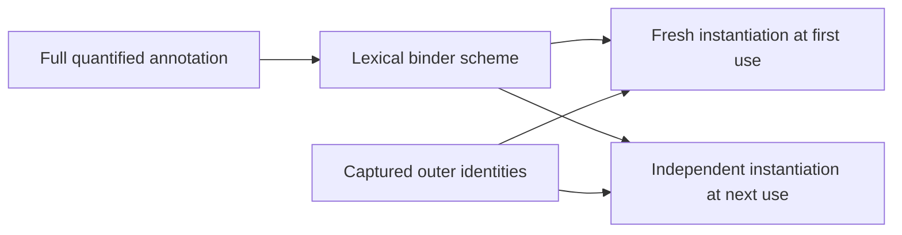

Local type synonyms now publish their own invisible-parameter contract, separate
from ordinary parameters. Their bodies use the same solved source-occurrence
indices as signatures, then abstract only declaration-owned identities. A body
with unclosed identities emits an error; it never stores globally shared fresh
variables as if they were parameters. Constraint-alias uses retain their source
span too. Parenthesized applications look up the inner application's span, where
kind inference recorded the solution.

Declaration conversion binds both each parameter's local name and its stable
kind identity. Solved occurrences consult that identity first. An anonymous
synonym binder may share an identity with another declaration's named binder;
that other declaration's spelling must not create a new free variable in the
synonym body. This preserves the closure check rather than weakening it.

Expansion matches the two parameter spines separately and substitutes them
simultaneously, preserving caller variables and function multiplicity. Saturation
is decided before traversing arguments; an undersaturated spine is rebuilt once,
not re-expanded at every prefix. Imported synonyms keep their existing contract;
this local elaboration does not invent missing imported kind metadata.

Source expansion freshens each stored forall binder lexically, including nested
aliases, before any use can enter the rigid checking map. Normalization of an
already-converted type remains idempotent and does not allocate another binder.
Checking equations and lambdas opens expected result-spine foralls rigidly while
consuming pattern arguments; it cannot strip the binder and specialize it to Bool.

An opened invisible kind parameter retains its classifier even when the argument
is inferred. Each newly solved equality checks that classifier using known local
or builtin term contracts, and propagates it across unresolved variable aliases.
It visits the new substitution entries, not the entire growing environment.
Runtime-polymorphic arrow binders therefore carry RuntimeRep, promoted GADT schemes
keep their source classifiers, and Refl quantifies its inferred kind separately
from its specified value. Unknown imports and open bound terms remain unproved.

Classifier validation owns one scoped proof cache. Before checking a term's
arguments it reserves a result variable; a recursive obligation reuses that
variable instead of opening the same polymorphic head indefinitely. Completing
the check unifies the reserved result with the derived classifier, so reuse is
not an assumption of validity. The cache retires at the outer solved-substitution
boundary, before local binding authority can change. Distinct work is capped at
16384 terms and active classifier recursion at128; exhaustion emits its own
error, not a successful or silently skipped proof. These bounds are local to
classifier validation, not a claim that every compiler traversal is bounded.

The flat annotation producer retains qualified Type/Constraint names and explicit
constructor/list promotion. Losing a qualifier changes binding authority; losing
the tick on '[] changes a promoted value into the list type constructor. The
AstKind conversion preserves an ordinary list kind as an application of `[]` to
its element kind. Promoted values, tuples and literals now use an
AstKindChirho::TypeSyntaxChirho payload containing the original TypeChirho,
instead of dropping the entire annotated binder when the smaller kind grammar
cannot express it. Naming, dependency collection, lexical free-variable discovery,
checked conversion and TH reification visit that payload through their type
visitors. Promoted cons/nil terms are distinct from the ordinary list type
constructor. The static converter without contextual kind checking cannot infer
this payload's contract and remains unsupported rather than inventing a kind.
Controls check BoxedRep, TupleRep, tuple and literal classifiers and reject
wrong representation arguments; this is not complete TupleRep execution support.

Annotation checking must constrain the expression's classifier to Type, not only
compute and discard it. In Haskell2010/NoPolyKinds publication, defaulting updates
the identities shared by the body, pending applications and binder discovery;
rewriting only the body would leave unused phantom quantifiers in the interface.

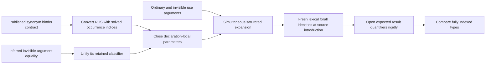

Top-level open equations of locally declared families now share the closed-row
classifier checker, after local declaration kinds are published. Their recorded
nominal occurrences reach the type-level equation converter. Conversion has an
explicit equation policy: retain family applications rather than eagerly reducing
definitions, and do not issue a partial-signature warning for a pattern wildcard.
Only variables present in the converted matching inputs may occur in the result.
Type-pattern kind ascriptions now use the retained syntax and solved promoted
indices described below. Variables bound only in a classifier must reach the
actual matching inputs; a new RHS variable or weaker closure check cannot replace
that representation.

Family equations now store distinct invisible-kind and ordinary-type inputs in
TypeFamilyClauseChirho. The same solved occurrence map supplies invisible family
applications at use sites. One substitution matches both input sets; an unknown
kind cannot select whichever equation happens to be first. Reduction preserves
visibility while rebuilding an oversaturated result, and equality deferral finds
the family through either application form. The driver transports these typed
clauses between modules instead of flattening their inputs into a positional list.
This transport does not yet establish authoritative imported source kind schemes.

Captured quantifier keys follow identity substitution when SCC publication replaces
a written metavariable with its rigid representative. Neither source spelling nor
equation order identifies that representative. Conflicting captures for a single
published binder emit an error. An annotation's implicit name likewise reuses its
known lexical classifier after the temporary annotation environment closes; its
next occurrence must not acquire a fresh kind-of-kind.

Known Prelude class classifiers enter the same kind environment as other known
bindings. The ordinary Eq/Ord/Show/Read/numeric/enumeration classes have
`Type -> Constraint`; using one as a type-family argument must not manufacture
a fresh imported classifier. Local declarations may shadow these entries through
the normal binding path. This supplies known builtin contracts only, not missing
authoritative kind schemes for arbitrary imported modules.

Constraint synonym licensing is checked on each alias's solved terminal result
kind, including a partially applied class such as `type Showish = Show`. Without
ConstraintKinds it emits GHC-75844's declaration-level contract even if the alias
is never used; an unrelated application error cannot stand in for this check.
Type-family declarations are distinct and may manipulate Constraint without this
alias license. The rule is documented by the
[GHC constraint-kind guide](https://ghc.gitlab.haskell.org/ghc/doc/users_guide/exts/constraint_kind.html)
and tested separately against installed GHC9.14.1.

Raw pragma extraction retains edition directives until all LANGUAGE/OPTIONS_GHC
tokens have been collected. One shared normalizer selects the last edition and
puts its defaults before all explicit feature choices in their original order.
Thus an explicit NoConstraintKinds is not undone by a later GHC2021, and an
explicit ConstraintKinds survives a later Haskell2010. The same normalized state
feeds pre-layout contextual classification and the lowered module. No-explicit-
edition behavior remains unchanged. This does not claim complete extension
implications or edition membership: the existing GHC2024-as-GHC2021 expansion
is still incomplete. See the
[GHC edition guide](https://ghc.gitlab.haskell.org/ghc/doc/users_guide/exts/control.html).

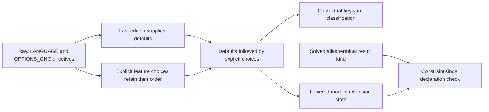

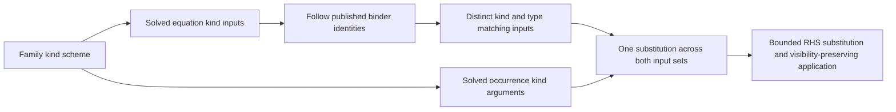

The type-level family normalizer has a16384-node substitution budget per family
application and retains its existing depth limit. The shared equation matcher no
longer exposes an unbounded production wrapper. This is not a bound on all compiler
traversals. Kind-level family reduction still uses its guarded visible-only rows;
the new type-level inputs do not silently extend its injectivity claim.

Not complete: hidden inputs in kind-level family reduction, promoted indices
outside the represented local/builtin contracts below, associated-row scope,
imported constructor schemes and specificity, and complete higher-rank kind subsumption. The frozen f5c4eedb
diagnostic recovered T12045a but exposed twelve new accept failures relative to
its predecessor; that checkpoint is not landable. Keeping KindApp in the type IR
does not establish that every producer has supplied its inferred arguments.

### Checked module companions (isolated row484)

The driver carries typing-owned ModuleTypeContractsChirho beside naming's
ModuleIfaceChirho. Published kind templates retain quantified identities,
classifier dependency order and specificity; aliases retain the already-closed
ordinary/hidden parameter spines. They are not inferred again from raw AST.
An export template must be closed, with each classifier referring only to its
preceding quantified identities. Transport rebases all bound IDs simultaneously
before kind inference in the receiving module.

Naming chooses the imported/exported roots. A visited dependency closure adds
private type contracts used by those roots or their value schemes, not every
contract in the provider. Private names retain the defining module through
re-exports and never become naming exports. The type unifier's older qualified-
basename compatibility rule is not replaced by this transport; identity retention
in the companion is not a claim that every downstream equality consumer is sound.

Checked source companions take priority over authored interface-only contracts.
The known Identity classifier is Type -> Type. Missing arbitrary imports do not
authorize a guessed classifier. Legacy raw-AST entry points remain explicit.
Ordinary module, project, Cabal and file/source paths now carry the companion;
incremental-cache inputs, complete hs-boot import context, promoted constructor
templates and kind-family reduction tables still need their own consumers.

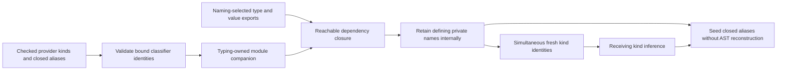

### Type ascriptions and promoted matching indices (isolated row484)

TypeChirho::KindAnnotChirho owns both the annotated type and its written kind,
with their source spans. AstKindChirho carries the same shape inside data and
forall binder annotations. The flat and structured lowerers preserve the full
node; the first double colon in a record field is its separator, not a reason
to discard a later classifier. Bare alias results, instance arguments and nested
binder annotations enter the same checking path. Naming and dependency visitors
visit both children. TH SigT conversion and reification retain both children;
this does not repair the separate loss of kinded forall binders in TH conversion.

```mermaid
flowchart LR
  AscriptionSyntaxChirho[Retain type and written classifier] --> AscriptionNamesChirho[Resolve both children and lexical binders]
  AscriptionNamesChirho --> AscriptionSpineChirho[Open one provider scheme for the mixed application spine]
  AscriptionSpineChirho --> AscriptionCheckChirho[Check written contract with rigid quantified binders]
  AscriptionCheckChirho --> AscriptionUseChirho[Instantiate only the ascription's visible quantifiers]
  AscriptionUseChirho --> AscriptionIndicesChirho[Record solved provider indices and anonymous pattern identities]
  AscriptionIndicesChirho --> AscriptionTermsChirho[Materialize matching type terms after kind validation]
  AscriptionTermsChirho --> AscriptionClosureChirho[Require RHS closure over actual matching inputs]
```

Provider arguments and currently available visible quantifiers are different
things. A monomorphic `(Proxy :: Bool -> Type)` still needs Proxy's Bool index
in its elaborated term but offers no `@` argument. A written `forall k. k -> Type`
checks with rigid binders first; Maybe cannot acquire that polymorphic kind by
specializing the annotation. Only occurrence-owned provider variables may depend
on the fresh checking binders. The verification substitution is local and its
checking skolems are replaced by fresh use variables before it is committed.
This is a represented-spine contract, not arbitrary higher-rank subsumption.

Promoted occurrences carry their namespace through elaboration; a same-spelled
type and data constructor must not share a head lookup. A checked context-free
GADT's promoted scheme uses the same fresh field/result scope as its validation,
so classifier inference cannot introduce an unrelated extra quantifier. Recorded
hidden indices become matching inputs to promoted patterns, including keys that
occur only in field ascriptions. The family RHS closure rule is unchanged.

An anonymous source pattern owns one identity keyed by its real span. Kind
checking and type conversion share that identity; they must not invent separate
LHS and RHS wildcards. The map is module-scoped and bounded by source occurrences.
Promoted list literals use the same solved element-kind index for their cons and
nil terms as explicit promoted constructors do. This covers the primary checked
conversion path, not the older static converter without kind elaboration.

The fresh AscribedKeyChirho and AscribedSpineChirho sources have independently
measured GHC9.14.1 outputs and run unchanged through STG, LLVM and Cranelift.
Contradictory equality, missing classifier/RHS names, fixed-kind false
polymorphism, hidden visible-argument use, and nested annotation controls reject.
Reference records retain exact source hashes and diagnostics under
test-data-chirho/kind-oracles-chirho/ascriptions-chirho. The legal ClassifierCycle
control is no longer an expected failure. These focused results do not establish
that row484 is landable; exact corpus sets and broad gates are recorded separately.

## Evidence boundary

Lowering controls retain both annotations and their exact source-slice spans, and keep
the following signature. Naming controls distinguish the two scopes and prove
both contracts are visited. Kind controls exercise composition, contradiction,
cache independence and the Constraint rule before constructor use can mask an
error. The driver uses one GHC-9.14.1-executed source for inline, standalone,
combined-data and combined-newtype contracts, with output 42/7/11/13 through
STG, LLVM and Cranelift. Execution and full-gate results are recorded in the
unit tasklist, not inferred from these source-level controls.

Still outside scope: arbitrary promoted/named/dependent kinds, complete imported
constructor/equation metadata, and the
separate data-family/type-data/refined-GADT-result AST decisions.
Symbolic standalone signatures, attachment to aliases/classes,
and duplicate/orphan signature diagnostics remain separate parser limitations.
The representation repair is not full TypeAbstractions checking: declaration-head
specificity matching, complete dependent constructor/selector quantifier metadata,
TH reification visibility, and cross-module consumers beyond the companion paths
above remain incomplete. The tasklist keeps independently reproduced counterexamples.
