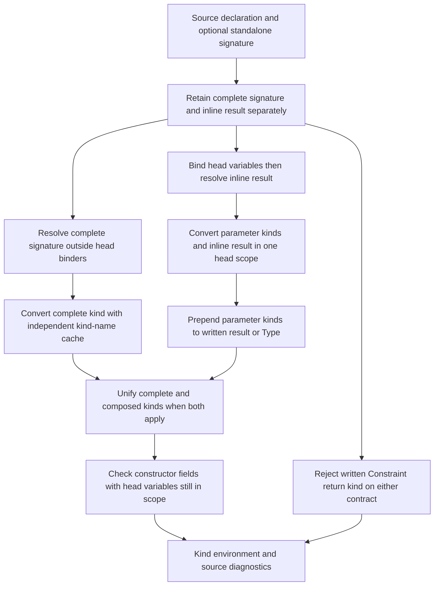

<!-- For God so loved the world, that he gave his only begotten Son, that whosoever believeth in him should not perish, but have everlasting life. — John 3:16 (KJV) -->

# Data/newtype kind contracts

An inline `data T a :: K` annotation describes only the remaining result kind.
A separate `type T :: K` describes the complete kind in a separate lexical
scope. `DataKindSigChirho` retains either or both; absence is not a fabricated
annotation. This distinction is shared by data and newtype declarations.

The standalone conversion swaps the kind-name cache instead of cloning the
growing environment. Fresh identities and accumulated substitutions survive;
the prior name cache is restored. Head annotations and an inline result share
their local kind identities. A complete signature is related to the head by
structural unification, not by matching variable spellings. The cache swap is
O(1); this does not claim the whole module kind pass is linear.

The no-inline default is Type even with a standalone signature. GHC 9.14.1
rejects `type T :: Type -> Type; data T where MkT :: T Int`: a missing head
argument is not supplied implicitly by that complete signature. Conversely,
`data T :: Type -> Type where ...` has a written result arrow and zero head
parameters, so its arrow is retained. Complete kinds are never prefixed twice.

GHC-55233 is checked on both written contracts with one diagnostic, independently
of the existing Type/Constraint unification compatibility. Binder annotations
are not result annotations; local Constraint shadowing retains its previous
boundary. No broadening of that compatibility rule is part of this repair.

## Evidence boundary

Lowering controls retain both annotations and their exact source-slice spans, and keep
the following signature. Naming controls distinguish the two scopes and prove
both contracts are visited. Kind controls exercise composition, contradiction,
cache independence and the Constraint rule before constructor use can mask an
error. The driver uses one GHC-9.14.1-executed source for inline, standalone,
combined-data and combined-newtype contracts, with output 42/7/11/13 through
STG, LLVM and Cranelift. Execution and full-gate results are recorded in the
unit tasklist, not inferred from these source-level controls.

Still outside scope: rigid kind skolems, complete polymorphic kind schemes,
arbitrary promoted/named kinds, imported authoritative kind metadata, and the
separate data-family/type-data/refined-GADT-result AST decisions.
Symbolic standalone signatures, attachment to non-data/newtype declarations,
and duplicate/orphan signature diagnostics remain separate parser limitations.
