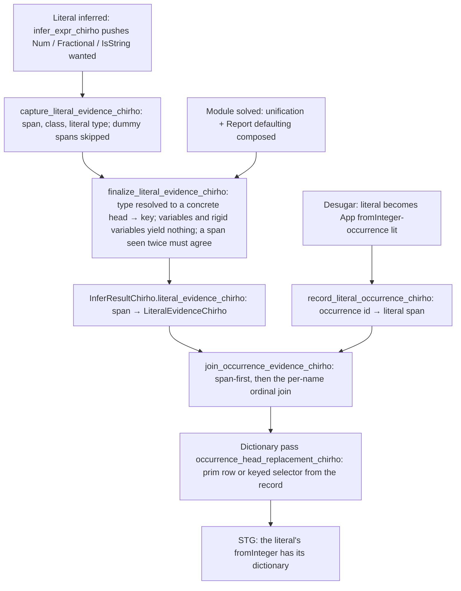
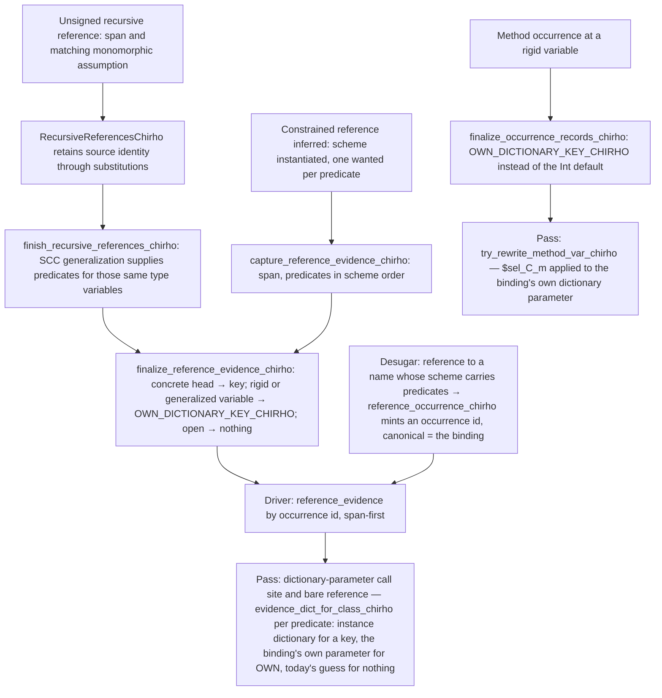
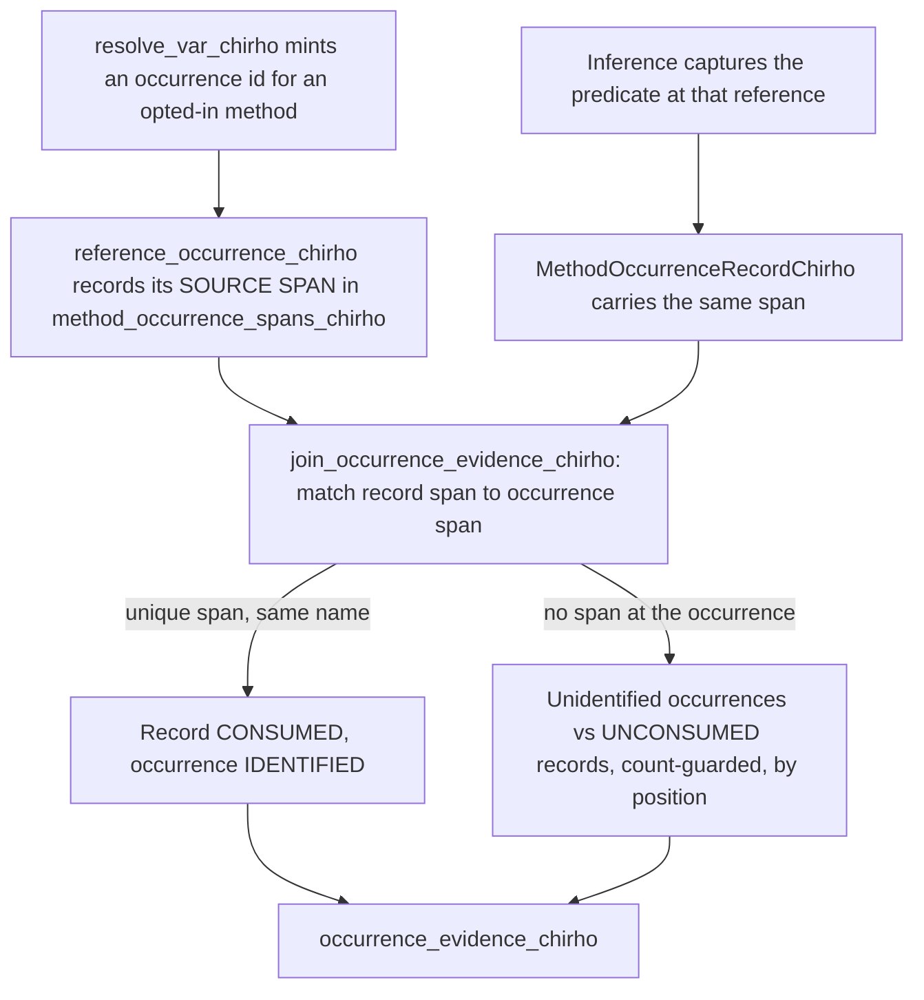

<!-- For God so loved the world, that he gave his only begotten Son, that whosoever believeth
in him should not perish, but have everlasting life. — John 3:16 (KJV) -->

# Dictionary evidence workflow

The dictionary pass used to decide instances by looking at Core syntax (sibling arguments,
literal markers, constructor names, binder types) and by treating a binding's ground scheme
predicates as proof. The checker already solves every constraint; this workflow hands the
pass what the checker proved, one record per source token, and the pass consults a record
before any heuristic. Programs without a record keep today's path and today's verdict.

## Invariants

- A record names one source token: keys are spans, never per-name ordinals, so inference
  order does not have to match desugar order (a generated node has the dummy span and no
  record). **This invariant was stated here before it was true of method occurrences**: they
  were joined by a per-name ordinal until 2026-09-19. See "Method occurrences" below; the
  lesson is that an invariant in this document is not evidence about the code, and the join it
  describes has to be read.
- Only a concrete head is evidence. A literal whose type is still a unification variable or a
  rigid variable produces no record; the enclosing binding's dictionary parameter (or today's
  fallback) serves it.
- A span the checker inferred more than once (a re-check, a speculative branch) yields a record
  only when every inference agreed.
- The join maps the checker's `Integer` default onto the engine's `Int` rows at the driver
  boundary and nowhere else.
- No heuristic in the pass is widened by this workflow; records are consulted first, and the
  heuristics remain the fallback until a gate retires them.

## Reference evidence (bricks 3 and 4)

- An own-parameter record names the signature predicate it stands for (`$own:k`, recorded when
  the signature is skolemized: `record_own_dictionary_indices_chirho`); the pass keys every
  dictionary binder by predicate index as well as by class, so two predicates of one class are
  two parameters. The class-only form (`$own`) remains for superclass extractions and for
  generalized variables, where the pass's class-keyed parameter is the right one.
- A reference occurrence is seen through by every dictionary-parameter lookup
  (`canonical_id_chirho`), and the spine pre-pass leaves an evidenced reference in place so the
  call-site path can read its records; one it finds no evidence for is restored to its
  canonical id before STG, exactly as method occurrences are.
- The higher-order-argument rewriter hands an evidenced reference to the variable arm; a key
  guessed from sibling arguments never dispatches a reference the checker proved.
- An unsigned recursive call initially has no scheme predicates to capture. Its name,
  source span and matching monomorphic assumption are retained until the existing SCC
  generalization supplies the predicates. This delays evidence capture, not inference or
  generalization. The every-capture-at-one-span agreement rule is unchanged; a shadowed
  name with a different type assumption is not treated as that recursive binding.
- Nested calls with reference evidence take the normal evidence-first rewrite path. The
  surrounding result type is not substituted for the callee's predicate type (`Eq a`
  must not become `Eq [a]` merely because a recursive deduplicator returns a list).
- Definition-side and call-side dictionary parameters share
  `resolved_pred_dictionary_chirho`: omit a parameter only if the same ground or
  permitted-default dictionary actually exists. A result-only Applicative/Monad
  variable is not a numeric default, and cannot vanish from the caller's argument list.
- Polymorphic `pure`/`return` with a scheme's own dictionary must use its method selector
  before any enclosing-monad heuristic. Their result type may be IO, Maybe or list;
  retaining their bare names would incorrectly force every call onto IO.
- Execution tests call the same unsigned recursive renderer at Int, Bool and Double,
  with a String separator, and check recursive equality on list elements. These read
  the evidence back through behavior, rather than asserting a particular internal key.

## Local bindings (brick 8)

A `let`/`where` binding generalized over a class is not in the module environment and gets no
dictionary parameter from the pass. Its evidence is the type the enclosing code instantiates it
at: `generalize_local_chirho`'s quantified variables are marked local, every instantiation of
the binding records its fresh variables (`instantiate_scheme_parts_chirho`), and
`local_specialization_key_chirho` yields a key when all of them resolve to one concrete head,
transitively when an instantiation resolves to another local binding's variable (`isPrime n =
checkDiv n 2`). Methods, literals and constrained references at that variable carry the key;
two disagreeing instantiations prove nothing and keep today's path.

## Method occurrences (repaired 2026-09-19)

The desugarer mints one occurrence id per free reference of an opted-in class method, in
DECLARATION order. The checker counts references of that name in INFERENCE-VISIT order, and
instance method bodies are inferred last (phase 3e). `join_occurrence_evidence_chirho` matched
those two sequences BY POSITION under a count guard, so a module with two `show` references
exchanged their evidence: the same program printed `W3` or `WChirho 3` depending only on which
declaration came first. The occurrence was rewritten to `$prim_Show_show_Int` before any
dictionary path ran, so the user's instance was found under the wrong key, and the same defect
crashed ("no matching alternative for tag 66") when a nullary and a one-field instance shared a
module.

- A proof serves ONE reference: a record the span join consumed can never be reused by the
  positional path, and vacancy in the consumer map is not ownership of a proof.
- An ambiguous or duplicated span identifies nothing and does not fall through to a positional
  assignment; its occurrence simply carries no evidence.
- The positional path exists only because the desugarer mints occurrences at several sites and
  only the variable-reference site records a span. Deleting it turns 19 driver tests red (all
  desugared shapes); restricting it to names whose occurrences all lack spans regresses a
  derived `Show` of a Bool field in a native round trip, where main is correct. It goes away
  when every mint site carries its own occurrence provenance, which a span alone cannot supply:
  one do or deriving node can create several references sharing a span, so the identity must be
  shared with the node that created them.

## Current boundary

- Infix references (`x \`f\` y`) and operator sections still resolve through the shared
  canonical id; only prefix references mint occurrence ids.
- Class methods never mint reference occurrences (the method paths key on canonical ids);
  own-parameter evidence therefore reaches the standard method list only, and a user class
  method at a rigid variable is still dispatched by the pass's inferred parameter keys.
