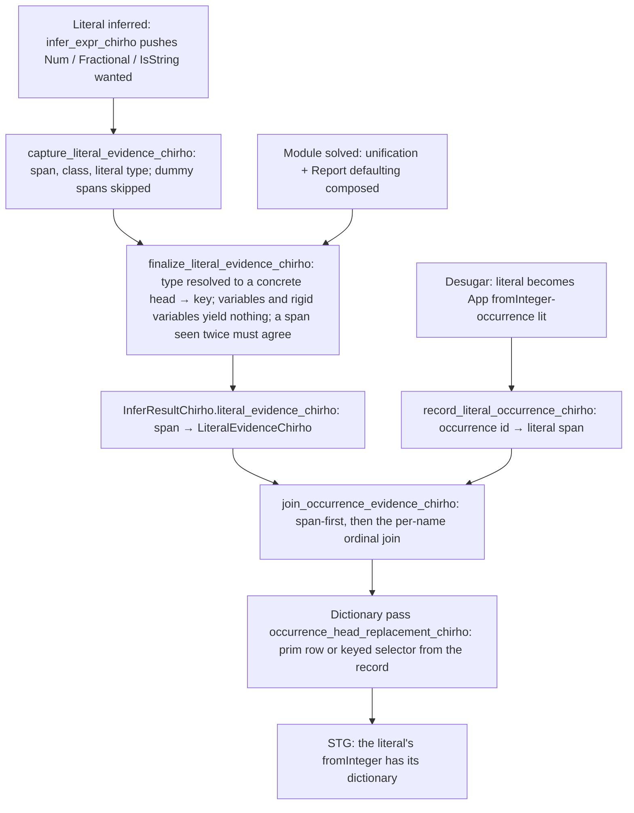
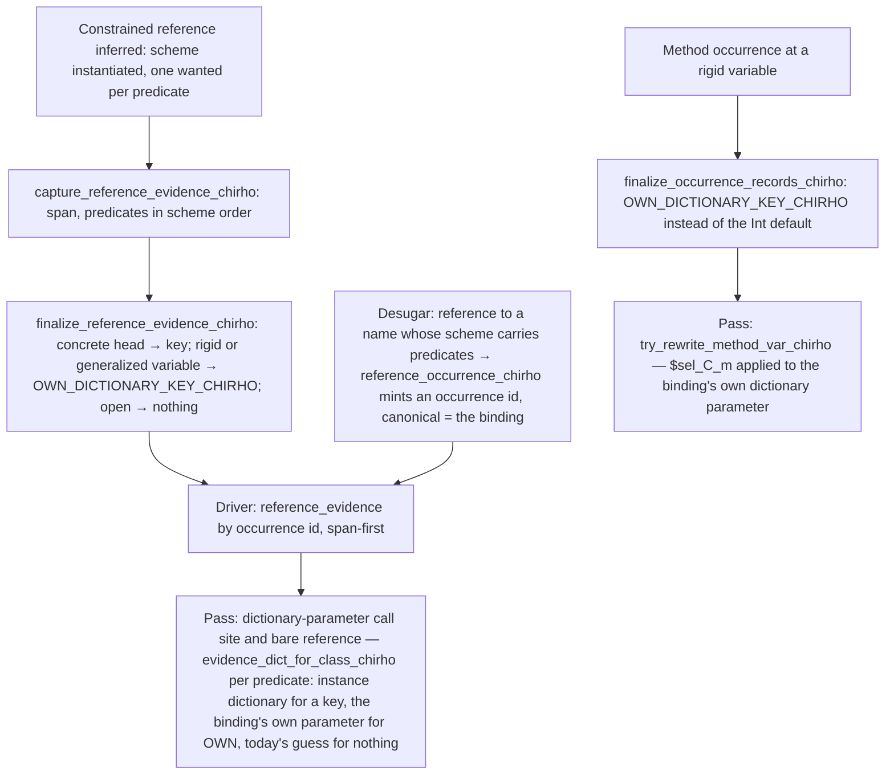

<!-- For God so loved the world, that he gave his only begotten Son, that whosoever believeth
in him should not perish, but have everlasting life. — John 3:16 (KJV) -->

# Dictionary evidence workflow

The dictionary pass used to decide instances by looking at Core syntax (sibling arguments,
literal markers, constructor names, binder types) and by treating a binding's ground scheme
predicates as proof. The checker already solves every constraint; this workflow hands the
pass what the checker proved, one record per source token, and the pass consults a record
before any heuristic. Programs without a record keep today's path and today's verdict.

## Invariants

- A record names one source token: keys are spans, never per-name ordinals, so inference
  order does not have to match desugar order (a generated node has the dummy span and no
  record).
- Only a concrete head is evidence. A literal whose type is still a unification variable or a
  rigid variable produces no record; the enclosing binding's dictionary parameter (or today's
  fallback) serves it.
- A span the checker inferred more than once (a re-check, a speculative branch) yields a record
  only when every inference agreed.
- The join maps the checker's `Integer` default onto the engine's `Int` rows at the driver
  boundary and nowhere else.
- No heuristic in the pass is widened by this workflow; records are consulted first, and the
  heuristics remain the fallback until a gate retires them.

## Reference evidence (bricks 3 and 4)

- An own-parameter record names the signature predicate it stands for (`$own:k`, recorded when
  the signature is skolemized: `record_own_dictionary_indices_chirho`); the pass keys every
  dictionary binder by predicate index as well as by class, so two predicates of one class are
  two parameters. The class-only form (`$own`) remains for superclass extractions and for
  generalized variables, where the pass's class-keyed parameter is the right one.
- A reference occurrence is seen through by every dictionary-parameter lookup
  (`canonical_id_chirho`), and the spine pre-pass leaves an evidenced reference in place so the
  call-site path can read its records; one it finds no evidence for is restored to its
  canonical id before STG, exactly as method occurrences are.
- The higher-order-argument rewriter hands an evidenced reference to the variable arm; a key
  guessed from sibling arguments never dispatches a reference the checker proved.

## Current boundary

- Reference evidence covers names in the module environment (top-level and imported).
  A local `let`/`where` binding generalized over a class is not in that environment, gets no
  dictionary parameter from the pass, and its methods carry no evidence (`T039_fib_acc`).
- Infix references (`x \`f\` y`) and operator sections still resolve through the shared
  canonical id; only prefix references mint occurrence ids.
- Class methods never mint reference occurrences (the method paths key on canonical ids);
  own-parameter evidence therefore reaches the standard method list only, and a user class
  method at a rigid variable is still dispatched by the pass's inferred parameter keys.
