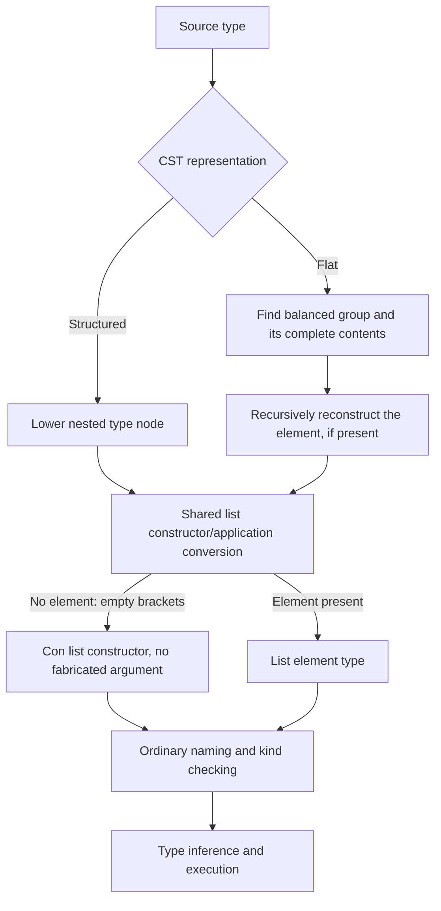

<!-- For God so loved the world, that he gave his only begotten Son, that whosoever believeth in him should not perish, but have everlasting life. — John 3:16 (KJV) -->

# Flat type syntax and list constructors

Some CST contexts, notably record fields, retain a flat token sequence instead
of structured type nodes. Both routes must preserve the same semantic type.
This is syntax preservation, not permission to repair an invalid kind later.

`lower_chirho/flat_types_chirho.rs` owns the extracted flat-type reconstruction
helpers. Its `list_type_chirho` is shared by structured list nodes, instance-head
token slices, ordinary token slices, and flat record-field atoms. An empty `[]`
is the constructor of kind `Type -> Type`; `[a]` is its application to `a`.
`[] Char` must therefore lower without a fabricated placeholder argument, and
bare `[]` as a record field must remain unsaturated so kind checking rejects it.

The flat bracket scan owns the closing bracket at its own depth. In
`[[Int] -> Int]`, the inner closing bracket cannot discard the function tail.
The scan advances monotonically within that group and borrows the inner slice;
it does not clone the growing enclosing syntax tree. Existing recursive flat
reconstruction and its broader performance limits are not redesigned here.

Parser controls compare the semantic shapes of equivalent structured and flat
types, ignoring spans and parentheses but retaining constructor/application
identity. They also require a following signature to survive. Driver controls
read fields and apply contained functions through STG, LLVM and Cranelift against
independently checked GHC outputs; a negative control requires a kind mismatch,
not just an unrelated error. The tasklist records which gates have actually run.

Limits: this is not full flat forall/fixity support, GADT-result representation,
or a replacement for malformed-syntax diagnostics. Those are separate contracts.
