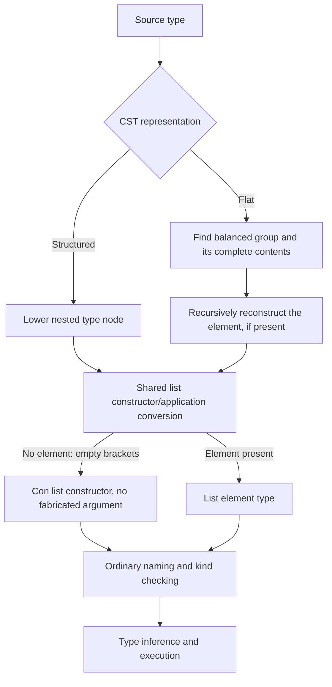
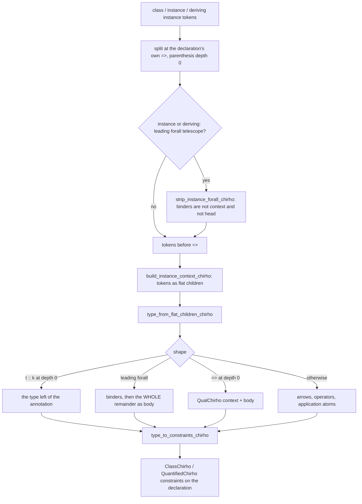

<!-- For God so loved the world, that he gave his only begotten Son, that whosoever believeth in him should not perish, but have everlasting life. — John 3:16 (KJV) -->

# Flat type syntax and list constructors

Some CST contexts, notably record fields, retain a flat token sequence instead
of structured type nodes. Both routes must preserve the same semantic type.
This is syntax preservation, not permission to repair an invalid kind later.

`lower_chirho/flat_types_chirho.rs` owns the extracted flat-type reconstruction
helpers. Its `list_type_chirho` is shared by structured list nodes, instance-head
token slices, ordinary token slices, and flat record-field atoms. An empty `[]`
is the constructor of kind `Type -> Type`; `[a]` is its application to `a`.
`[] Char` must therefore lower without a fabricated placeholder argument, and
bare `[]` as a record field must remain unsaturated so kind checking rejects it.

The flat bracket scan owns the closing bracket at its own depth. In
`[[Int] -> Int]`, the inner closing bracket cannot discard the function tail.
The scan advances monotonically within that group and borrows the inner slice;
it does not clone the growing enclosing syntax tree. Existing recursive flat
reconstruction and its broader performance limits are not redesigned here.

Parser controls compare the semantic shapes of equivalent structured and flat
types, ignoring spans and parentheses but retaining constructor/application
identity. They also require a following signature to survive. Driver controls
read fields and apply contained functions through STG, LLVM and Cranelift against
independently checked GHC outputs; a negative control requires a kind mismatch,
not just an unrelated error. The tasklist records which gates have actually run.

Limits: this is not full fixity support, GADT-result representation, or a
replacement for malformed-syntax diagnostics. Those are separate contracts.

## Declaration contexts use this grammar

The tokens a class, instance or standalone-deriving declaration writes before its
`=>` are a context in the same syntax as a signature's context. They used to go
through a separate scanner (first constructor token = class, every variable token
= argument, commas split only outside parentheses, nothing for a segment with
`forall` or `=>`). `(Eq a, Show a)` became `Eq a a`, `C1 x T1` became `C1 x`,
`Duper (Fam a)` became `Duper a`, `class (B d, C d) => D d` had the superclass
`B` only, and an explicit `instance forall a. ... =>` lost its whole context.
Nothing in the AST recorded the loss, so no later phase could guard against it.

`lower_chirho/contexts_chirho.rs` owns the context entry point, the telescope
strip and the type-to-constraint conversion (shared with signature contexts).
The old scanner is deleted. Two rules of the flat grammar exist because of this
path and are tested on their own:

- **A leading forall scopes over everything to its right.** The `=>` and `->`
  splits used to run first, so `forall b. Eq b => Eq (f b)` became
  `(forall b. Eq b) => Eq (f b)` and `forall f. Type -> Type` became a function
  from a quantified kind. The structured signature path is the agreement oracle.
- **`(t :: k)` is the type `t`.** Main keeps no kind annotation on a type; the
  structured and token-slice paths already returned the left side. The flat path
  read the annotation as one more argument (`n Nat`). The record-field caller
  also swallowed every `::` after the first, so the annotation never reached the
  grammar; only the first `::` separates field names from the field type.

An instance's leading `forall a b.` binds its variables. It is stripped from the
context AND from the head (without a context the telescope sits in front of the
class name, and the class used to be lost). It is never a quantified given.

Runtime contract (GHC 9.14.1 outputs, `tests/declaration_contexts_chirho.rs`): a
class with two superclasses projects the second one; an instance context with two
members passes both dictionaries, two user classes included; an explicit instance
forall keeps its context. On the old lowering each of those programs was rejected
("could not deduce") or died at run time ("missing STG binding").

Boundaries, measured and NOT repaired here:

- The typing consumers still truncate a faithful context:
  `process_instance_decl_chirho` keeps only the first argument of each context
  constraint and drops quantified ones; `process_class_decl_chirho` stores
  superclasses by name. `Convert a String =>` therefore still behaves as
  `Convert a`. That belongs to the superclass-obligation brick
  (`instance-obligations-chirho.md`).
- Variable-headed predicates (`c a`) still become the `?` marker, in signatures
  and declarations alike.
- Standalone-deriving HEADS are still a flat constructor/variable scan.
- An instance at an applied data type (`Box a`, `Maybe a`) does not dispatch at
  run time: the dictionary is named from one rendering of the head
  (`$fDescribe(Box t1)`) and the methods from another
  (`$prim_Describe_describe_Box a`). Unrelated to contexts; it is why the runtime
  controls above use list heads.
