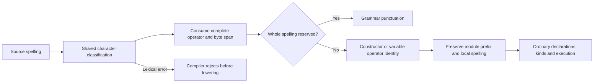
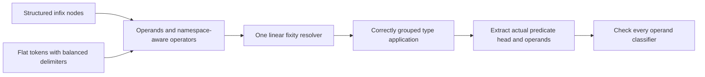
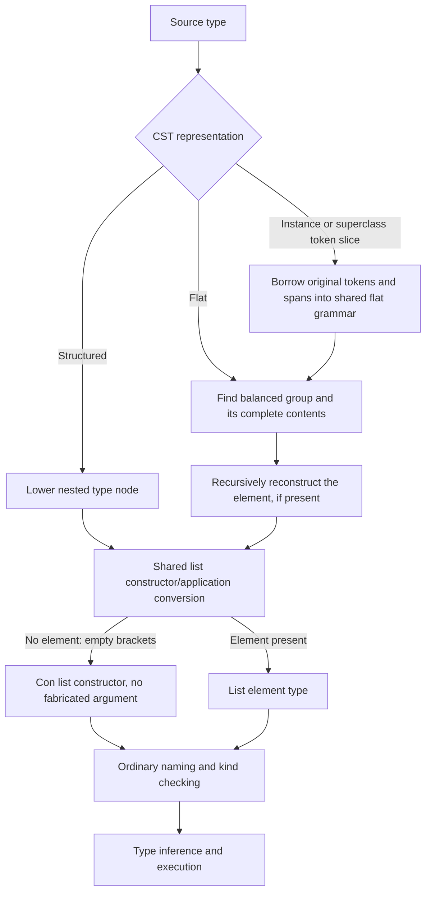
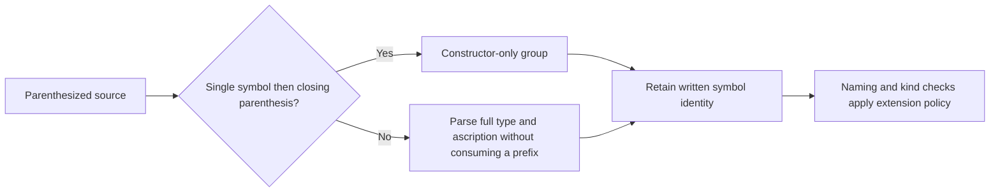
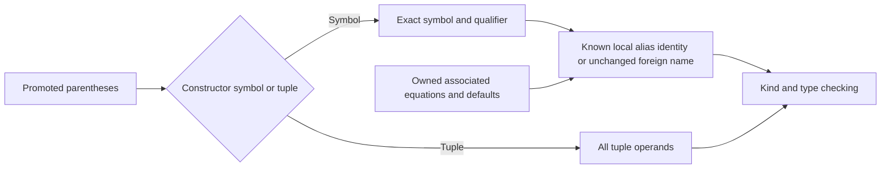
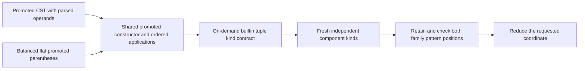

<!-- For God so loved the world, that he gave his only begotten Son, that whosoever believeth in him should not perish, but have everlasting life. — John 3:16 (KJV) -->

# Flat type syntax, list and promoted tuple constructors

Some CST contexts, notably record fields, retain a flat token sequence instead
of structured type nodes. Both routes must preserve the same semantic type.
This is syntax preservation, not permission to repair an invalid kind later.

## Operator identity before type reconstruction

`lexer_chirho/symbols_chirho.rs` owns the shared Unicode symbol predicate and
maximal-munch scanner. It classifies GHC's non-ASCII operator categories
using the exact-pinned unicode-general-category1.1.0 table: symbols plus
connector, dash and other punctuation. Bracket and quotation punctuation are
not operators in GHC9.14.1. This is narrower than the report's general
symbol/punctuation wording; the implementation follows the explicit category
mapping in [GHC's lexer interface](https://raw.githubusercontent.com/ghc/ghc/ghc-9.14.1-release/compiler/GHC/Parser/Lexer/Interface.hs),
with measured GHC-21231 bracket controls, not a spelling blacklist. Letters,
marks, digits, whitespace and controls are not fabricated operator characters. ASCII
special delimiters retain their existing treatment. The CST uses the same
predicate when classifying a qualified operator, and consumes module prefixes
without dropping dots inside the operator's local spelling.

The entire operator is scanned before reserved punctuation is recognized.
Thus `:⊗:` is one constructor, and `->⊗` and `→⊗` are complete variable
operators, not an arrow followed by another token. A dash run followed by a
Unicode symbol is an operator, not a line comment. A parenthesized hash operator
is distinguished from an unboxed delimiter using that same predicate.
Scanning advances monotonically by UTF-8 character lengths; category lookup is
constant-time. Recovery after a malformed quoted character retains checked
string access, including when the old quote recovery stopped inside a scalar.

The compiler frontend uses `parse_lexically_checked_chirho` to reject the first
lexical error from the existing token stream before lowering. This prevents an
error token from becoming a recovery variable and an accepted declaration.
Lexical errors remain hard errors even under type-error deferral. The original
recovering parser remains available to tooling. Dependency-header discovery,
dependency ordering and import extraction deliberately use that loose pre-pass;
lexical failure is reported by the actual compile path. A malformed header can
still distort dependency discovery before compilation. This does not claim
complete grammar-error propagation or malformed-header scheduling.

The reference controls include unchanged T11754, qualified uses and dots,
reserved-prefix operators, Unicode spaces/identifiers, and a genuine result-type
mismatch. Thirteen single-module execution sources have independently measured
GHC9.14.1 output. This does not establish complete Unicode identifier support,
all UnicodeSyntax extension checks, or infix-constructor runtime dispatch: the
separate ASCII constructor execution control already fails on the parent.

The two representations also share the linear operator-chain resolver in
`lower_chirho/type_operators_chirho.rs`. Flat tokens retain the whole operand,
then enter the same precedence/associativity stack as structured infix nodes.
Parentheses shield an operand, backticked lowercase names remain variables,
and promotion ticks belong to the operator rather than its left operand.
The shared builtin table gives (~) and (~~) precedence4, as GHC9.14.1 reports.
Thus `xs :++ x ~ ys` compares `(xs :++ x)` with ys, and `xs ~ x ': rest`
compares xs with `(x ': rest)`. It must not invent a synthetic predicate head
that silently hides an invalid list tail. This is not complete fixity-error
diagnostics: rejecting conflicting/non-associative chains remains a separate
contract. No constraint-only precedence exception is introduced.

`lower_chirho/flat_types_chirho.rs` owns the extracted flat-type reconstruction
helpers. Instance-head argument token slices and superclass contexts now enter
the same reconstruction function as flat record fields, rather than a second
token grammar. This keeps promotion ticks, literal arguments, tuple constructors,
applications and ascriptions attached to their original spans. Its
`list_type_chirho` is shared by structured list nodes and this flat path. An empty `[]`
is the constructor of kind `Type -> Type`; `[a]` is its application to `a`.
`[] Char` must therefore lower without a fabricated placeholder argument, and
bare `[]` as a record field must remain unsaturated so kind checking rejects it.

An instance argument keeps its outer parentheses until this shared atom grammar
reads them. The single arrow in `(->)` is a constructor, not an incomplete
function with two invented operands; `((->) Int :: Type -> Type) Bool` retains
that constructor, application and annotation. A bare arrow is not licensed as
an atomic type by this rule, nor is promoted arrow syntax.

The structured CST path has the same boundary. Its small owner,
`cst_parser_chirho/parenthesized_types_chirho.rs`, recognizes a constructor-only
symbol only after looking ahead to the next significant closing parenthesis.
It must not consume the initial star of `(* -> *)` while speculating about `(*)`.
Every other group enters the ordinary type/ascription parser with all operands
still present. Lookahead is local to the next significant token, not a scan of
the remaining declaration or module.

Written stars in binder annotations remain named syntax during AST kind
conversion. Converting them eagerly to the unconditional Type variant bypasses
NoStarIsType; naming and kind checking own that extension-sensitive decision.
The GHC-reference controls cover nested star arrows, parenthesized atomic stars,
the prefix arrow constructor, equivalent Type spelling, and both an invalid
argument kind and disabled star syntax. They test acceptance through the real
frontend, not a particular temporary CST layout.

Promoted tuple parentheses retain every component in both paths. Structured
parsing in `cst_parser_chirho/promoted_types_chirho.rs` owns the delimiters and
parses each operand; `lower_chirho/promoted_types_chirho.rs` is the shared
constructor/application builder used by structured nodes and flat fields.
`'(a,b)` and `'(,) a b` denote the promoted pair constructor applied to two
operands; neither is ordinary `(a,b)` or promoted unit `'()`. Constructor-only
forms retain their arity. This matters for family equations: dropping either
coordinate invents an unbound RHS variable and destroys a valid projection.

Parenthesized constructor symbols are a distinct alternative: '(:) is the
promoted list constructor, not a unary tuple or an empty placeholder. The CST
requires a constructor-symbol token followed by the closing parenthesis; flat
lowering recognizes the same single-symbol shape. Both preserve qualifiers and
source spans. Consequently a Bool tail in '(:) Int Bool reaches actual kind
checking and fails, in a signature and in a flat record field alike.

For local promoted constructors, kind elaboration hands type inference the exact
self-qualified-to-local alias pairs already established by the constructor
registry. Signature, local synonym and top-level/associated family-equation
conversion share that lookup. The stored-syntax converter borrows it for local
associated instance patterns, results and default specialization; context-free
imported conversion receives no aliases from the consuming module. Associated
parameter binding and explicit-instance-over-default precedence are unchanged.
Equal bare names from other modules do not authorize normalization, and
ordinary type names are not rewritten through this promoted-namespace map. The
map is built once from local declarations and retired with the module. This does
not establish complete imported-constructor alias or malformed-syntax support.

The builtin contract is generated once per encountered arity, with work bounded
by that arity, rather than cloning a full tuple catalogue into every module.
It is intrinsic syntax with module lifetime, not a binding owned by the local
signature scope that first encounters it. Ordinary `(,)` classifies lifted
types; promoted `'(,)` has kind `forall k1 k2. k1 -> k2 -> (k1,k2)` and `'()`
has kind `()`. The component kinds are independently instantiated at every use.
Interpreted promoted tuple terms keep their quote namespace, like promoted lists.
These rules implement the [GHC DataKinds promotion contract](https://ghc.gitlab.haskell.org/ghc/doc/users_guide/exts/data_kinds.html#promoted-list-and-tuple-types),
not `NoListTuplePuns` or all malformed-syntax recovery.

The tuple reference controls use unchanged sources checked by GHC9.14.1:
two coordinate projections, a wrong-coordinate equality, prefix/unit forms,
nested tuples, mixed Bool/Nat component kinds, a wrong-kind component, and a
flat record field. The wrong-coordinate test requires E0200 and the wrong-kind
test E0300. A parser-only repair made six of seven pass but wrongly accepted the
wrong-kind case, demonstrating why syntax preservation alone was insufficient.

The flat bracket scan owns the closing bracket at its own depth. In
`[[Int] -> Int]`, the inner closing bracket cannot discard the function tail.
The scan advances monotonically within that group and borrows the inner slice;
it does not clone the growing enclosing syntax tree. Existing recursive flat
reconstruction and its broader performance limits are not redesigned here.

Parser controls compare the semantic shapes of equivalent structured and flat
types, ignoring spans and parentheses but retaining constructor/application
identity, tuple arity and application arguments. They also require a following signature to survive. Driver controls
read fields and apply contained functions through STG, LLVM and Cranelift against
independently checked GHC outputs; a negative control requires a kind mismatch,
not just an unrelated error. The tasklist records which gates have actually run.

Constructor headers have a separate delimiter-aware context boundary in
`cst_parser_chirho/constructors_chirho.rs`, shared by explicit-forall and
no-forall declarations. A context arrow must not become a field or consume a
following declaration. Context lowering distinguishes an implicit parameter's
`?label :: payload` from a type-kind ascription. The classifier checker requires
a lifted payload type; it does not silently erase unknown payload names.

Limits: the outer instance-head splitter is still a separate consumer, and this
does not establish all unparenthesized instance forms or complete flat
forall/fixity-error support. Ordinary/record constructor context evidence is still not
represented in the constructor AST; the boundary/read-back controls do not prove
full implicit-parameter evidence behavior. GADT-result representation
and malformed-syntax diagnostics also remain separate contracts.
