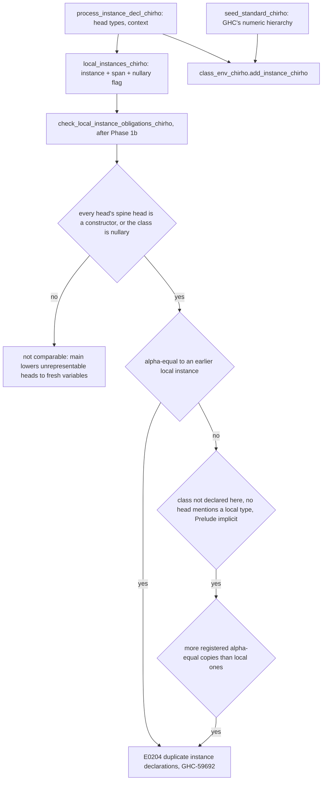

<!-- For God so loved the world, that he gave his only begotten Son, that whosoever believeth in him should not perish, but have everlasting life. — John 3:16 (KJV) -->
# Instance declaration obligations

An instance is not merely registered; it has to be allowed to exist. GHC checks this at the
declaration, before any use site. We registered every instance and asked nothing.

## Invariants

- **Alpha-equality of heads** (`ClassEnvChirho::instance_heads_alpha_equal_chirho`) matches all head
  types in both directions with `match_consistently_chirho`, which keeps a repeated variable
  consistent (`C a a` does not match `C Int Bool`); the second direction makes the renaming
  injective. Contexts never distinguish instances. The older `match_ty_chirho` composes
  sub-matches without comparing them and is unchanged for its existing callers.
- **Names are identities here**, so the non-local half fires only when no local declaration can
  shadow a seeded name: T11552 declares its own `MaybeT`, T10592 its own `Eq`.
- **A variable spine head is not evidence.** Main lowers type operators, promoted constructors,
  type-level literals and kind-indexed variables in instance heads to fresh type variables;
  comparing them would make unrelated heads equal (T11754, T13943, T22647).
- **The seeded numeric hierarchy is GHC's**, not the Haskell 98 report's: `Num` has no
  superclasses (a `Num a` given does not entail `Eq a`/`Show a`; a Num dictionary has no
  superclass slots) and `Integral` has `Real` and `Enum`, so `==` under `Integral a` comes
  through `Real => Ord => Eq`. `dict_chirho/layout_chirho.rs` derives slots from these lists.

## Superclass obligations — written, measured, NOT enabled

GHC-39999 "arising from the superclasses of an instance declaration". Strict entailment (a given
with superclass closure, or an instance whose sub-goals hold strictly; variables never assumed
satisfiable; depth exhaustion = unproved), argument-carrying superclass predicates, and GHC's rule
that a given's superclasses are usable only when the given is Paterson-smaller than the instance
head (tcfail223, T22891) are implemented and tested in the kit
`/private/tmp/haskelujah-instance-superclasses-kit-chirho/` and on the stacked branch. They wait on
two facts measured 2026-09-18:

1. **Completeness.** A locally declared head type is not a closed instance universe: an imported
   module that sees the type through a SOURCE import cycle may declare the orphan superclass
   instance, and GHC accepts it. The check may fire only when the module imports nothing but
   Prelude (or, later, when the driver proves the module has no hs-boot).
2. **Faithful contexts.** Main's `parse_simple_constraint_segment_chirho` takes the first ConId as
   the class and every VarId as an argument: `(Eq a, Show a)` becomes `Eq a a`, `C1 x T1` becomes
   `C1 x`, `Duper (Fam a)` becomes `Duper a`, and a `forall`/`=>` context is dropped whole. Nothing
   in the AST records the loss, so no checker-side guard can tell a mangled context from a real
   one; ten valid files were falsely rejected in the diagnostic pass. gpt's branch lowers contexts
   as types (`lower_chirho/contexts_chirho.rs`). Constraint synonyms in contexts (T10335) must be
   expanded as well.

## Boundaries

- Kind-shaped instance errors, family instances and abstract-class instances belong to the kind
  and boot-class work (row 484).
- Paterson conditions on instance contexts (GHC-22979) need the same faithful contexts.
