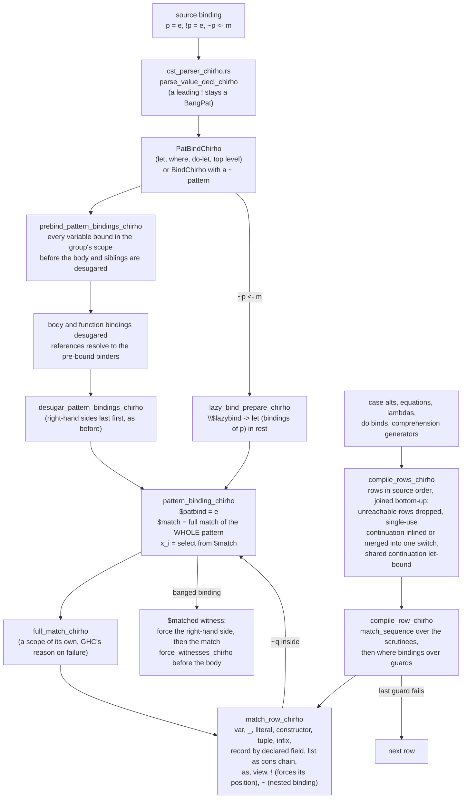

<!-- For God so loved the world, that he gave his only begotten Son, that whosoever believeth in him should not perish, but have everlasting life. — John 3:16 (KJV) -->
# Workflow: pattern matching

How a pattern becomes Core. Functions on this DAG carry a
`workflow: language-features-chirho/pattern-matching-chirho` comment.

There is ONE single-row matcher, `match_row_chirho`
(`crates/haskelujah-core-chirho/src/desugar_chirho/row_match_chirho.rs`): it matches one
pattern against one variable, left to right and depth first, continues with a success
expression once every variable of the pattern is in scope, and evaluates a failure expression
otherwise. It handles every pattern shape: a literal is tested wherever it appears, a record
matches its named fields at their DECLARED positions, a list is matched as the cons chain it
is (so its length is part of the match), and `~`, `!`, `@` and view patterns mean what the
Report and GHC say they mean.

Every position goes through it: pattern BINDINGS (below), and every MATCH position as ROWS
(`match_rows_chirho.rs`) - case alternatives, function equations, lambdas, do binds and
list-comprehension generators. A row is its patterns matched left to right, its `where`
bindings over its guards, and every failure (a pattern or the last guard) continuing with the
next row. The older per-position machinery is deleted.

## The rules it implements

- A pattern binding is LAZY: nothing is forced where it is bound, so an unused variable never
  fails (`let (Just n) = undefined in 5` is 5).
- Demanding ANY variable matches the WHOLE pattern (Haskell 2010 §3.17.3, rule (d)), so `x` in
  `(x, Just y) = (1, Nothing)` fails even though `x`'s own position matched. The match is
  built once and shared, not once per variable.
- A `~` below the binding's top keeps its sub-pattern OUT of the match: `(x, ~(Just y))` gives
  `x`, and demanding `y` then runs `Just y`'s own match.
- `!p = e` forces the MATCH before the body and not the variables:
  `let !(Just n) = Just undefined in 5` is 5, `let !(Just n) = Nothing in 5` fails. A bang
  deeper in the pattern forces its position when the match runs.
- An outer `~` on a binding changes nothing (a binding is lazy already), which is why a
  top-level `~(Just n) = ...` is an ordinary binding and no longer loops.

## Controls

`crates/haskelujah-driver-chirho/tests/lazy_patterns_chirho.rs`, each expectation measured on
GHC 9.14.1 and the key ones mutation-checked (a skipped literal test, an unforced witness, a
witness that forces the variable, record fields by listed order, an unforced inner bang: each
fails exactly its own control).

## Not yet covered

Tracked in `spec-chirho/tasklists-chirho/26-09-30_00-25-tasklist-full_pattern_match-chirho.md`:

- a PATTERN GUARD (`| Just y <- e`) does not fall through to the next row: lowering turns a
  guarded right-hand side containing one into a single unguarded expression, so the AST has no
  qualifiers for the rows to continue from;
- an as-pattern at the head of a binding (`whole@(a, b) = e`), which the parser reads as a
  function binding with a visible type argument.
