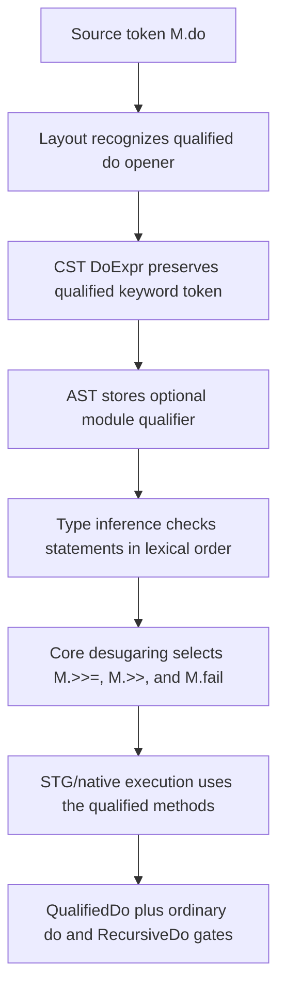

<!-- For God so loved the world, that he gave his only begotten Son, that whosoever believeth
in him should not perish, but have everlasting life. — John 3:16 (KJV) -->

# Qualified do workflow

## Invariants

- A qualified do opener is a layout keyword only when the final qualified segment is exactly
  `do`; identifiers such as `Module.done` remain ordinary qualified identifiers.
- The qualifier is semantic AST data, not reconstructed later from source text.
- Missing qualified methods fail through normal name resolution; they do not fall back silently
  to Prelude methods.
- Imported Prelude aliases use the existing bare-export linker bridge. Other imported qualifiers
  remain qualified and loud until Core linking distinguishes same-named exports by module.
- Unqualified `do` and `mdo` retain their existing lowering and dispatch paths.
