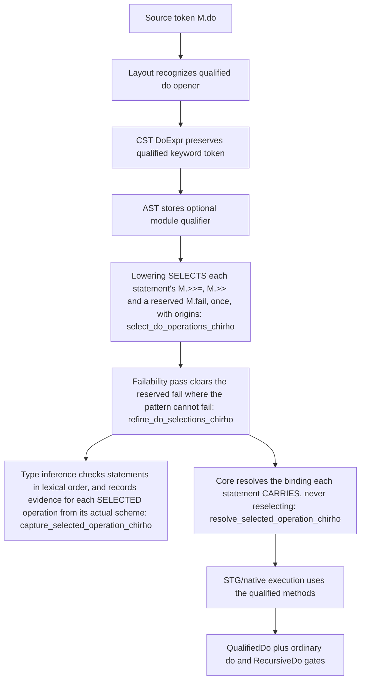

<!-- For God so loved the world, that he gave his only begotten Son, that whosoever believeth
in him should not perish, but have everlasting life. — John 3:16 (KJV) -->

# Qualified do workflow

```mermaid
flowchart TD
    source_chirho[Source token M.do] --> layout_chirho[Layout recognizes qualified do opener]
    layout_chirho --> parser_chirho[CST DoExpr preserves qualified keyword token]
    parser_chirho --> lower_chirho[AST stores optional module qualifier]
    lower_chirho --> select_chirho[Lowering SELECTS each statement's M.>>=, M.>> and a reserved M.fail, once, with origins: select_do_operations_chirho]
    select_chirho --> refine_chirho[Failability pass clears the reserved fail where the pattern cannot fail: refine_do_selections_chirho]
    refine_chirho --> typing_chirho[Type inference checks statements in lexical order, and records evidence for each SELECTED operation from its actual scheme: capture_selected_operation_chirho]
    refine_chirho --> desugar_chirho[Core resolves the binding each statement CARRIES, never reselecting: resolve_selected_operation_chirho]
    desugar_chirho --> runtime_chirho[STG/native execution uses the qualified methods]
    runtime_chirho --> gates_chirho[QualifiedDo plus ordinary do and RecursiveDo gates]
```

The choice of operation is made ONCE, by lowering, and both the checker and Core read that one
choice. Two phases that each chose could disagree, and the disagreement would stay invisible until
something one of them emitted failed to resolve - which is exactly how an irrefutable pattern used to
get a `fail` its monad might not have. See `tasklists-chirho/26-09-24_12-35-tasklist-do_selection-chirho.md`.

## Invariants

- A qualified do opener is a layout keyword only when the final qualified segment is exactly
  `do`; identifiers such as `Module.done` remain ordinary qualified identifiers.
- The qualifier is semantic AST data, not reconstructed later from source text.
- Missing qualified methods fail through normal name resolution; they do not fall back silently
  to Prelude methods.
- Imported Prelude aliases use the existing bare-export linker bridge. Other imported qualifiers
  remain qualified and loud until Core linking distinguishes same-named exports by module.
- Unqualified `do` and `mdo` retain their existing lowering and dispatch paths.
- `M.do` selects `M.>>=` even inside module `M`. Whether that qualified name resolves to a local
  binding is name RESOLUTION, and the resolver's self-qualified rule stays in the resolver; the
  selection carries the qualified name and nothing more.
- `fail` is selected only where the pattern can FAIL, by GHC's rule as measured against 9.14.1: a
  variable, wildcard, lazy pattern, or a sole-constructor pattern whose parts cannot fail selects
  none. A constructor from another module is not in the environment and stays failable.
- The checker's evidence covers only an operation whose type fits the monadic shape. An indexed,
  graded or plain-function operator records NO evidence rather than wrong evidence, and keeps the
  dispatch it has today. That evidence reaches no consumer yet: the join drops every role but
  Reference.
