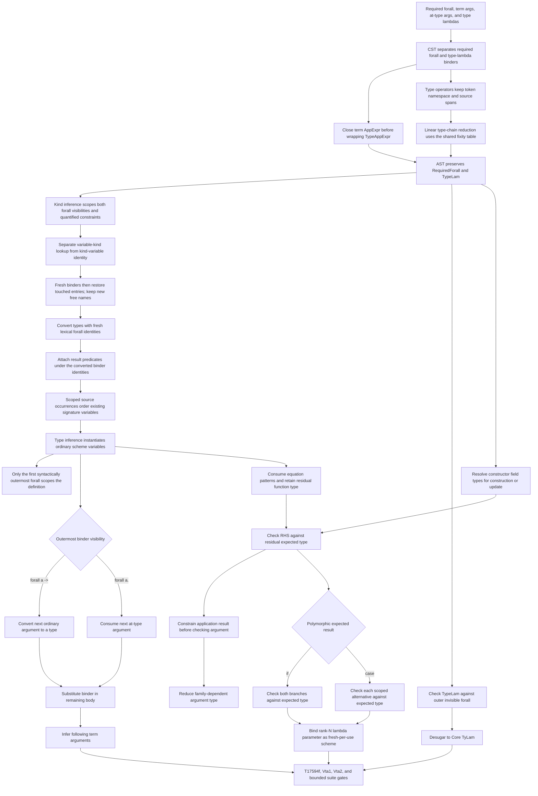

<!-- For God so loved the world, that he gave his only begotten Son, that whosoever believeth
in him should not perish, but have everlasting life. — John 3:16 (KJV) -->

# Rank-N visible type application workflow

## Invariants

- Explicit `forall` binders retain their written order. Implicit signature binders follow
  first source occurrence, including context occurrences before the body. Normalized infix
  `op a b` traversal and fresh-variable allocation order are not source order.
- The source inventory orders only variables already selected for quantification; it does
  not allocate variables, change generalization, or change evidence capture. Class parameters
  keep their existing leading order, and enclosing scoped/skolem variables stay excluded.
- Nested invisible/required foralls and quantified constraints hide their own bound names
  from the enclosing inventory. Source-less expansion variables retain the deterministic
  numeric-ID fallback. Equal/synthetic spans use stable traversal order.
- Surface conversion gives both forall visibilities fresh local identities and restores
  only their previous name bindings on exit, in reverse order. Free names discovered in
  the body survive. Scope bookkeeping grows with binder count, not environment size.
- Kind conversion follows the same lexical lifetime, but has two distinct lookup contracts:
  a type variable's inferred kind lives in the kind environment, while its identity when
  used as a kind lives in the kind-variable cache. Each explicit binder shadows/restores
  both entries without equating these two meanings. Kind annotations are converted before
  their own binder enters scope and after preceding binders; subsequent annotations reuse
  the nearest kind-variable identity. Quantified constraints use the same bounded scope.
- Leading signature binders and contexts are processed in lexical order, including
  parentheses: a later shadow cannot capture an earlier predicate. Result-spine predicates
  are converted under the matching internal forall IDs, not against a leaked final map.
- Signature quantification and definition scope are different contracts. Only the single
  syntactically outermost invisible forall group scopes the definition; parentheses or
  later forall groups do not. Existing enclosing scopes survive; explicit local binders
  shadow rather than reuse an enclosing binder's identity.
- Backticked lowercase type operators remain variables; symbolic and qualified constructor
  operators remain constructors. Parentheses delimit type chains; the shared fixity table
  determines precedence/associativity. Chain reduction pushes/reduces each item once.
- Required arguments consume only `forall a ->`; ordinary term applications cannot erase an
  invisible `forall a.` binder.
- Quantifiers nested inside a rank-N parameter are instantiated only when they are outermost at
  the application site; type application never skips a function arrow.
- Mixed application spines such as `f typeArg @Visible value` remain inside one equation and do
  not absorb the following declaration.
- Type-lambda binder order is preserved when term and type binders are mixed.
- An equation may consume fewer term arguments than its signature; its RHS is checked against
  the residual function type rather than falling back to unconstrained inference.
- When an application result is known, shared type variables are specialized before checking
  family-dependent argument types, so `F Char ~ Bool` can guide a `Bool` argument.
- Polymorphic expected types flow through `if` branches and scoped `case` alternatives before
  branch lambdas are inferred; each use of a rank-N lambda parameter is freshly instantiated.
- Record construction and update also deliver the known field type before lambda inference.
  A field of type `(forall a. a -> a) -> (Int,b)` may use its argument independently
  at Int and Char. Type-changing updates preserve the existing two constructor
  instantiations and equality of untouched fields; only RHS checking gains the
  expected type. The isolated row484 branch records an exact-output GHC/STG control
  and a wrong-result-type rejection; this is not a new main-line claim until gated.
- Monomorphic and GADT branch inference keeps its established lenient merge path.
- Existing top-level scheme-variable instantiation remains the first path.
- Unsupported or excessive type arguments remain diagnostics/fallbacks rather than silently
  changing an unrelated monomorphic type.

## Current boundary

- Type fixities come from current-module top-level declarations and the existing
  built-in/default table, not imported custom fixity metadata. Diagnostics for
  invalid mixed/non-associative chains are separate existing work.
- Type-chain collection/reduction performs linear aggregate work and heap storage,
  but CST/AST traversal still uses a depth-proportional call stack. This is not an
  adversarial-depth stack-safety guarantee.
- General implicit kind-dependency ordering (GHC's stable topological sort) is not claimed:
  ordinary kind annotations are not retained as a general `TypeChirho` node. Existing
  explicitly written forall order is preserved, not a substitute for the missing information.
- Kind-binder lexical lifetime is covered independently of the surface/signature map.
  It does not add rigid kind skolems, dependent kinds or a polymorphic-kind scheme
  representation. Standalone-kind-signature binders scope within that signature, not
  over its following declaration ([GHC standalone-kind-signature scoping rules](https://ghc.gitlab.haskell.org/ghc/doc/users_guide/exts/poly_kinds.html#standalone-kind-signatures-and-polymorphic-recursion)).
  General declaration-head/standalone-signature reconciliation remains a separate contract.
- The separate type-synonym RHS converter still uses its existing fixed-ID/name-substitution
  representation. General synonym alpha-renaming/capture avoidance is not claimed by the
  surface/signature scope repair.
- The existing flat scheme-predicate representation still lifts result-spine contexts;
  preserving their lexical IDs is not full support for contexts inside rank-N parameters
  or a new representation of nested qualified types.
- Required declaration arguments are matched positionally; named required binders are not yet
  added to the scoped type-variable environment of the equation body.
- Template Haskell reification currently maps required and invisible foralls to the existing
  `ForallTChirho` representation because the TH type AST does not yet encode binder visibility.
