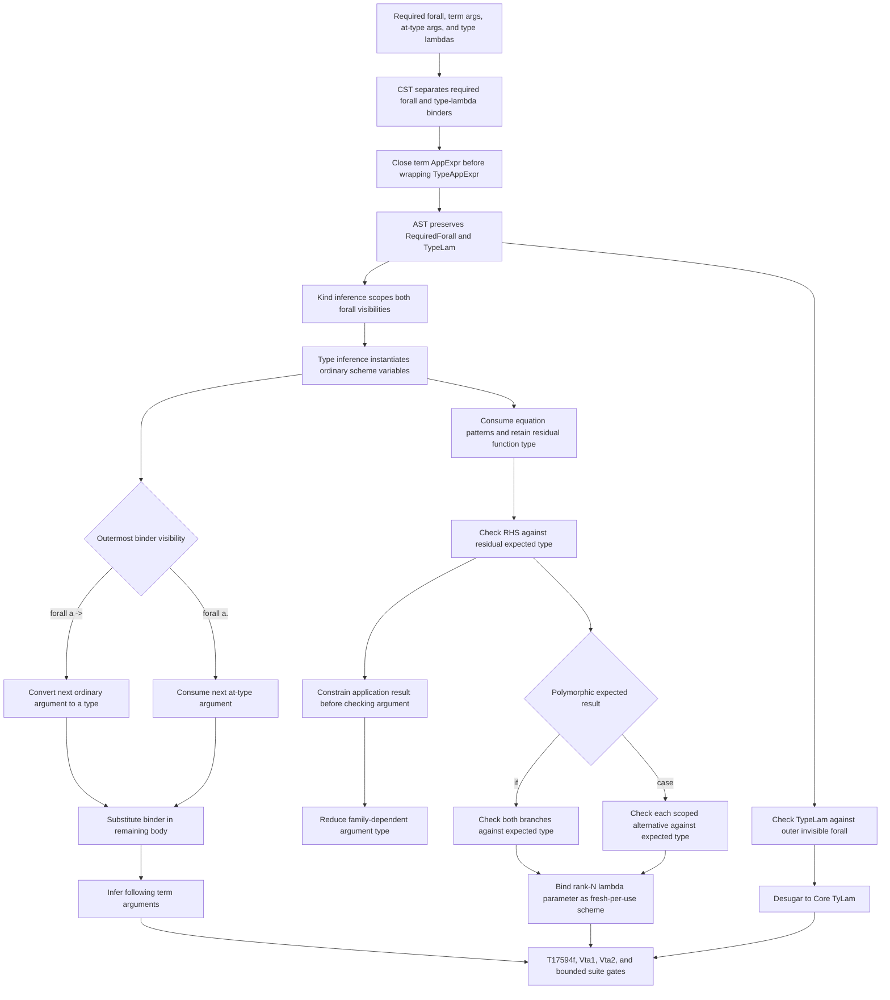

<!-- For God so loved the world, that he gave his only begotten Son, that whosoever believeth
in him should not perish, but have everlasting life. — John 3:16 (KJV) -->

# Rank-N visible type application workflow

## Invariants

- Explicit type arguments consume quantified variables in source order.
- Required arguments consume only `forall a ->`; ordinary term applications cannot erase an
  invisible `forall a.` binder.
- Quantifiers nested inside a rank-N parameter are instantiated only when they are outermost at
  the application site; type application never skips a function arrow.
- Mixed application spines such as `f typeArg @Visible value` remain inside one equation and do
  not absorb the following declaration.
- Type-lambda binder order is preserved when term and type binders are mixed.
- An equation may consume fewer term arguments than its signature; its RHS is checked against
  the residual function type rather than falling back to unconstrained inference.
- When an application result is known, shared type variables are specialized before checking
  family-dependent argument types, so `F Char ~ Bool` can guide a `Bool` argument.
- Polymorphic expected types flow through `if` branches and scoped `case` alternatives before
  branch lambdas are inferred; each use of a rank-N lambda parameter is freshly instantiated.
- Monomorphic and GADT branch inference keeps its established lenient merge path.
- Existing top-level scheme-variable instantiation remains the first path.
- Unsupported or excessive type arguments remain diagnostics/fallbacks rather than silently
  changing an unrelated monomorphic type.

## Current boundary

- Required declaration arguments are matched positionally; named required binders are not yet
  added to the scoped type-variable environment of the equation body.
- Template Haskell reification currently maps required and invisible foralls to the existing
  `ForallTChirho` representation because the TH type AST does not yet encode binder visibility.
