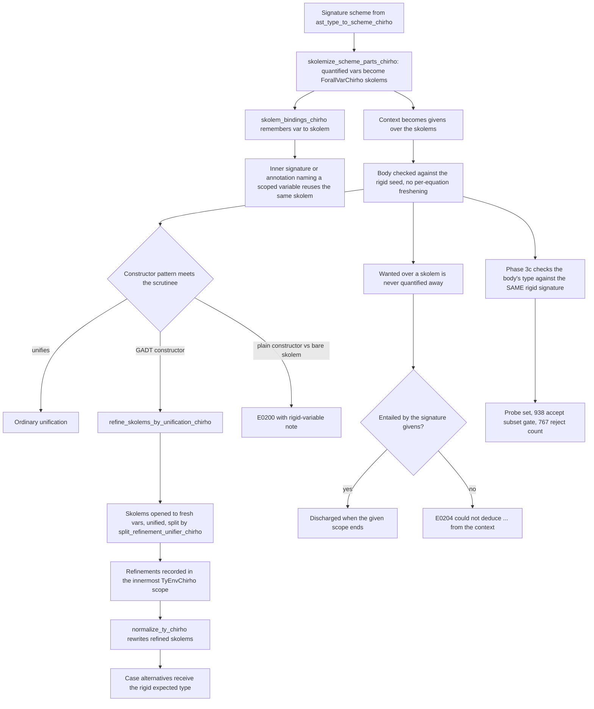

<!-- For God so loved the world, that he gave his only begotten Son, that whosoever believeth
in him should not perish, but have everlasting life. — John 3:16 (KJV) -->

# Rigid type variables and local given equalities workflow

A binding checked against its signature must not be allowed to decide what the signature's
type variables are: `f :: Int -> a; f x y = x + y` is an error, not `a := Int -> Int`. The
checker therefore makes signature variables *rigid* (skolems) for the duration of the body
check, and re-does GADT refinement as *local given equalities* that live in the innermost
type-environment scope instead of freshening the signature per equation.

## Invariants

- A skolem is a `TyChirho::ForallVarChirho` whose name carries the `%N` marker
  (`skolem_chirho::SKOLEM_MARKER_CHIRHO`); `Display` prints the source name only. Skolems unify
  only with themselves; a unification variable may still be solved *to* a skolem.
- Synonym and type-family pattern variables also use `ForallVarChirho` but never carry the
  marker, so `rewrite_skolems_chirho` never touches them.
- Refinements are scoped by `TyEnvChirho::push_scope_chirho` / `pop_scope_chirho`: a GADT
  equality disappears exactly when the pattern variables it came with go out of scope.
  `apply_subst_chirho` and `free_vars_chirho` cover refinement targets.
- Only a constructor whose declared result is not `T a b …` with distinct variables may refine
  (`constructor_result_refines_chirho`): `IntE :: Int -> Expr Int`, `Refl :: Equal a a`, or a
  constructor whose equality context was folded into its result.
- A plain constructor pattern against a bare rigid scrutinee is reported (`f :: a -> Int;
  f (Just x) = 1`); everything else keeps the pre-existing lenient pattern path.
- `generalize_with_io_defaulting_chirho` never absorbs a predicate that mentions a skolem into a
  scheme: it stays deferred for the enclosing signature's givens, or is reported.
- ScopedTypeVariables: `ast_type_to_scheme_seeded_chirho` applies `skolem_bindings_chirho` and
  never re-quantifies a scoped id, so an inner signature, annotation (`e :: a`) or type
  application (`@a`) written in terms of an enclosing `forall a.` names that `a`'s skolem. The
  extension is on under GHC2021 and off under an explicit Haskell2010 / Haskell98
  (`scoped_type_variables_enabled_chirho`); a class method signature seeds its class variables
  but quantifies them, class variables first.
- The checking-mode `case` path is entered whenever the expected type contains a skolem, so each
  alternative meets the rigid result through its own refinement.
- A skolem is only ever made from a variable the programmer wrote (`tyvar_source_names_chirho`);
  variables from synonym expansion or lowering artifacts stay flexible.
- A reference to a binding with a type signature is not a dependency edge
  (`binding_groups_chirho`, RelaxedPolyRec; disabled under Haskell98), so an unsigned binding
  mutually recursive with a signed one is generalized on its own.
- A pattern binding's variables all leave the environment before any is generalized or checked;
  a signed one is generalized, freshly instantiated, and then checked against its rigid
  signature by subsumption.
- Wanteds are discharged at a given scope's end through instances whose contexts the givens
  entail, and improved by the functional dependencies of the givens in scope; the substitution
  reaches every argument of a multi-parameter predicate. Only a wanted the givens took part in
  solving (directly, through an instance context, or by naming a rigid variable) leaves the
  deferred list there; one that instances alone settle stays for generalization, because the
  dictionary pass reads a binding's ground scheme predicates as its evidence
  (`givens_discharge_wanted_chirho`).
- "Could not deduce" is reported only when no instance could ever apply
  (`rigid_pred_certainly_undeducible_chirho`): fully visible class, simple argument shapes, and
  a bare rigid argument matched only by a variable-headed instance.

## Current boundary

- Existential constructor variables are still instantiated as unification variables, not
  skolems, and a constructor's context is still a wanted rather than a given.
- Class default methods and instance methods are checked with the class variables as
  unification variables, not skolems.
- IO defaulting of a lone Monad/Functor-constrained variable still applies to argument-less
  top-level bindings.
