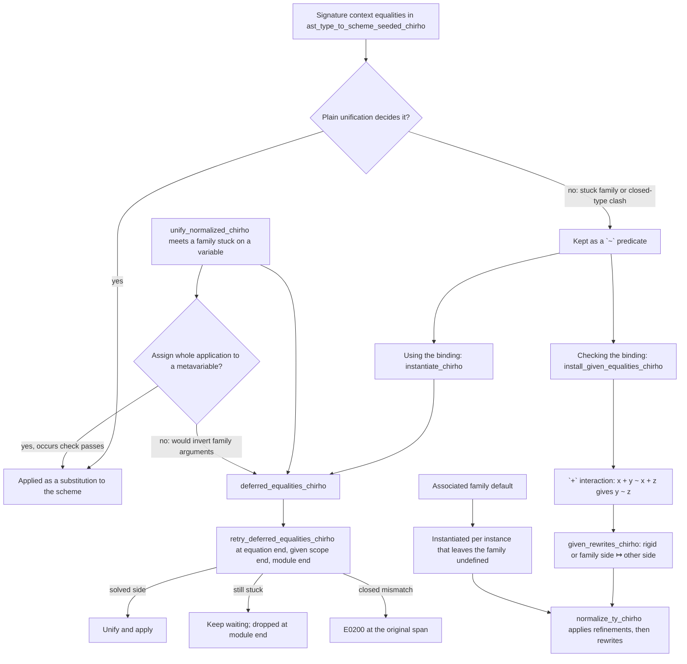

<!-- For God so loved the world, that he gave his only begotten Son, that whosoever believeth
in him should not perish, but have everlasting life. — John 3:16 (KJV) -->

# Stuck type-family equalities and given equalities workflow

A type-family application whose argument is still an unsolved unification variable cannot be
compared with anything yet (`n ~ N t` before `t` is known), and a signature context may state an
equality that unification alone cannot decide (`F a ~ Bool =>`, `Int ~ Bool =>`). Both used to be
reported as mismatches; now the first is *deferred* and the second becomes a *rewrite rule*.

## Invariants

- An associated type family's default is never a general equation of the family: `type Fam a =
  Maybe a` inside a class produces `Fam Int = Maybe Int` for `instance Cls Int`, and nothing for an
  abstract `a`.
- Deferral happens only when a family application is stuck on a *unification variable*
  (`ty_is_stuck_family_on_var_chirho`); a family stuck on a rigid variable is decided by the given
  rewrite rules or reported.
- Structural-unification success is not evidence of injectivity. In the isolated
  row484 branch, `defer_stuck_family_equality_chirho` also defers `G a ~ G b`
  rather than deriving `a ~ b`; assigning an entire application to a metavariable
  is still allowed when the occurs check passes. A GHC9.14.1/STG record-update
  control has `G T1 = G T2 = Int` while another field changes Char to Bool.
  This is the noninjective default, not implementation of user-written
  [injectivity annotations](https://downloads.haskell.org/ghc/latest/docs/users_guide/exts/type_families.html#injective-type-families).
- Rewrite rules are oriented from the side that cannot otherwise be simplified (a rigid variable
  or a family application) to the other side; two differing closed types (`Int ~ Bool`) also
  become a rule, which is how an insoluble given types its unreachable body.
- Given rewrites and deferred equalities follow the running substitution
  (`apply_subst_all_chirho`), and rules are truncated with the givens they came from.
- `~` never reaches class reasoning: it is skipped by the unsolvable and undeducible checks, and
  instantiating a scheme turns a `~` predicate into a deferred equality, not a class wanted.
- Discharging wanteds at a given scope's end also solves through instances whose contexts the
  givens entail (`pred_entailment_under_givens_chirho`), and improves wanteds by the functional
  dependencies of the givens in scope (`fundep_improve_from_givens_chirho`). A wanted that
  instances settle on their own — the `Num Int` of a literal — is NOT discharged there
  (`givens_discharge_wanted_chirho`): it stays deferred so generalization absorbs it into the
  binding's scheme, which is where the dictionary pass reads the evidence for the body's class
  methods. Discharging it early left `take 5 "hello"` with a bare `fromInteger` at run time.

## Current boundary

- A constraint written with type operators (`a + b ~ a + c`) is mis-lowered by the parser as a
  class constraint headed by `+`; the `+` interaction rule is therefore only reachable through
  the AST shapes the lowering produces today (parser lane).
- Injectivity of user-declared families is not modelled; only the builtin `+` interaction exists.
- Equalities still stuck on an ambiguous variable at the end of the module are dropped rather
  than reported as ambiguity.
