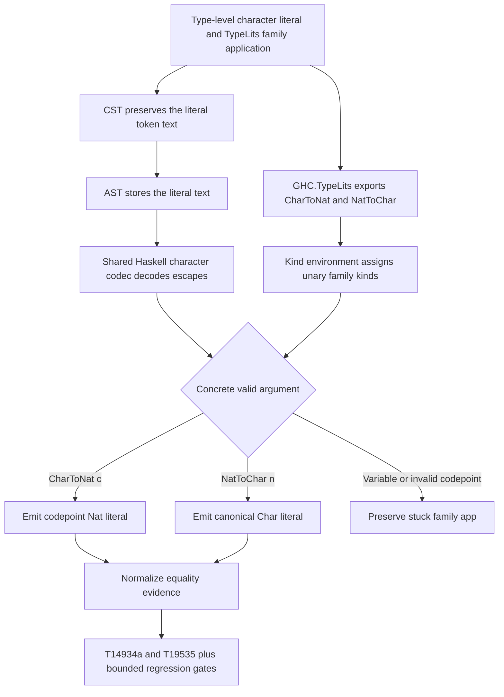

<!-- For God so loved the world, that he gave his only begotten Son, that whosoever believeth
in him should not perish, but have everlasting life. — John 3:16 (KJV) -->

# Type-level character family workflow

## Invariants

- Term and type-level character literals share one escape parser; family reduction cannot
  reinterpret source text differently from expression lowering.
- Qualified and unqualified TypeLits family names reduce identically.
- `CharToNat` returns the Unicode scalar value of a concrete character.
- `NatToChar` reduces only a valid Unicode scalar value; out-of-range and surrogate codepoints
  stay stuck.
- Symbol and Nat family reduction behavior remains unchanged.
