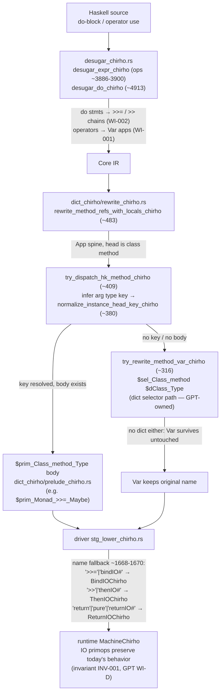

<!-- For God so loved the world, that he gave his only begotten Son, that whosoever believeth in him should not perish, but have everlasting life. — John 3:16 (KJV) -->
# Workflow: typeclass method dispatch (Functor/Applicative/Monad)

How a class-method use (`fmap`, `<*>`, `>>=`, `>>`, `return`/`pure`) travels the pipeline,
and where per-type dispatch happens. Functions on this DAG carry a
`// workflow: monadic-dispatch-chirho` comment in code.

Key invariant (INV-001): user-level `>>=`/`>>`/`return`/`pure` may only be *positively*
dispatched to a `$prim_*` body when the type key resolves and the body exists; every
unresolved case must reach STG under its original name so lines 1668-1670 keep the
IO fast path byte-identical. IO primops (`bindIO#`/`thenIO#`/`returnIO#`) stay primops.

See `spec-chirho/prd_chirho.json` work items WI-001 (operators), WI-002 (do-notation),
WI-003 (return/pure position) for the active changes on this DAG.
