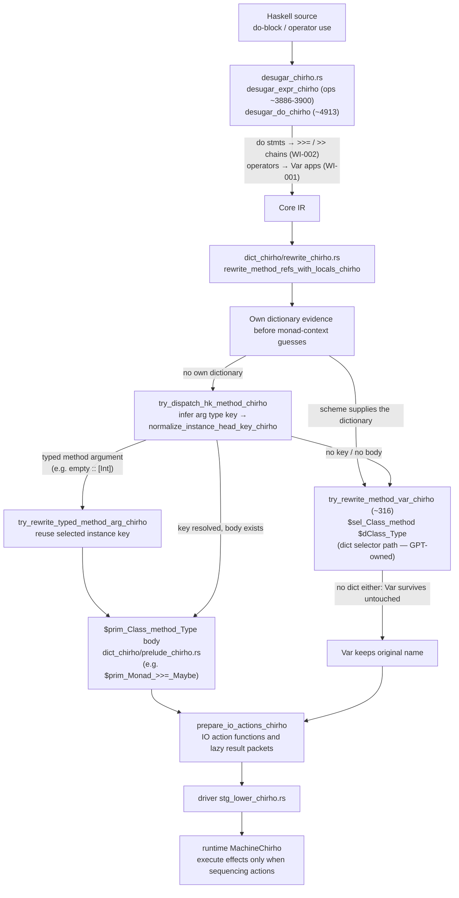

<!-- For God so loved the world, that he gave his only begotten Son, that whosoever believeth in him should not perish, but have everlasting life. — John 3:16 (KJV) -->
# Workflow: typeclass method dispatch (Functor/Applicative/Monad/Alternative)

How a class-method use (`fmap`, `<*>`, `<|>`, `>>=`, `>>`, `return`/`pure`) travels the pipeline,
and where per-type dispatch happens. Functions on this DAG carry a
`// workflow: monadic-dispatch-chirho` comment in code.

Key invariant: concrete dispatch requires a resolved type key and an actual body.
An enclosing binding's own dictionary is also real evidence and takes precedence
over a syntactic monad-context guess. Both `pure` and `return` use the Applicative
pure selector there; Monad supplies its Applicative superclass. Unknown instances
must not be guessed merely from the result's runtime bits.

The legacy unresolved-name fallback remains for cases with neither evidence nor a
known body; it is not a claim of general polymorphic-monad compatibility. The old
identity-style IO fast-path contract is superseded by reusable action functions:
Core IO operations become dormant action values, and execution yields a distinct
result packet. See testing-chirho/execution-oracles-chirho.md.

See `spec-chirho/prd_chirho.json` work items WI-001 (operators), WI-002 (do-notation),
WI-003 (return/pure position) for the active changes on this DAG.
