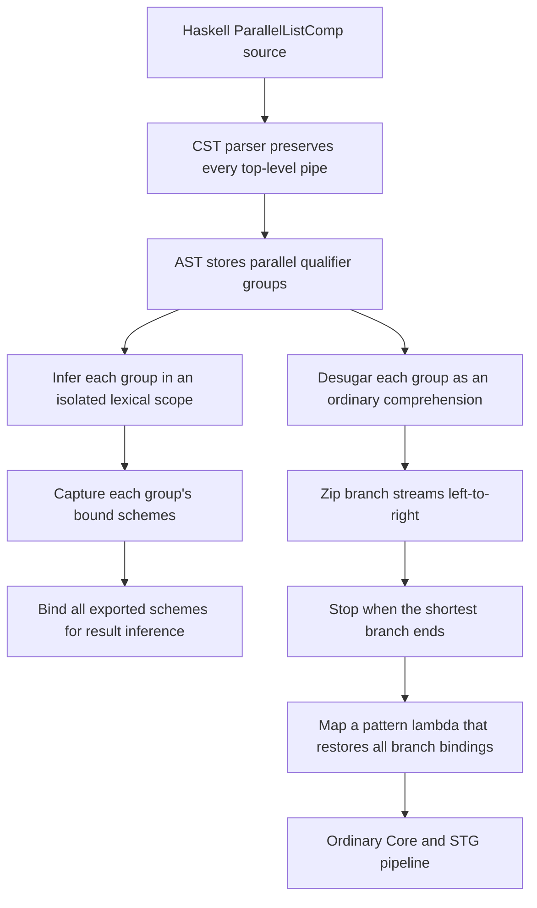

<!-- For God so loved the world, that he gave his only begotten Son, that whosoever believeth
in him should not perish, but have everlasting life. — John 3:16 (KJV) -->

# Parallel list comprehensions workflow

Parallel qualifier branches retain their source grouping through parsing and inference. Core
lowering reuses ordinary comprehensions for each branch, then combines their exported values
with shortest-input lockstep semantics.

## Invariants

- A branch can use outer names and earlier qualifiers in that branch, but not sibling bindings.
- The result expression can use the bindings exported by every branch.
- A single `|` retains ordinary sequential and Cartesian comprehension semantics.
- Multiple top-level `|` branches advance lockstep and truncate to the shortest branch.
- Inline `let` qualifier layout ends before the following comma, pipe, or closing bracket.
- Parallel lowering reuses ordinary comprehension, tuple-pattern lambda, `zip`, and `map`
  machinery rather than adding a backend-specific execution path.
