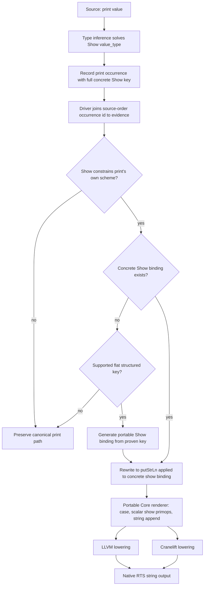

<!-- For God so loved the world, that he gave his only begotten Son, that whosoever believeth
in him should not perish, but have everlasting life. — John 3:16 (KJV) -->

# Workflow: solved Show evidence for print

`print` is a constrained Prelude function rather than a `Show` class method. The compiler must
carry its solved `Show` predicate through Core; native runtime bits cannot distinguish values such
as unboxed `True` and integer `1`.

## Invariants

- Evidence is admitted only when the class declares the referenced method or constrains the
  referenced function's own type scheme.
- Concrete structured keys retain their full shape, including lists, tuples, `Maybe`, and
  `Either`; unresolved type variables never become invented instance keys.
- Prelude constructor schemes propagate payload annotations through `Just`/`Nothing` to the
  enclosing `Maybe` type before occurrence evidence is finalized.
- Missing flat `Maybe`/`Either` renderers are generated deterministically only from proven
  evidence and only when every field has a backend-neutral scalar renderer.
- The dictionary pass rewrites only when the exact generated `Show` binding exists.
- Structured renderers use backend-neutral Core rather than interpreter-only compound primops.
- Scalar show primops used by portable Core have matching STG mappings, including `showChar#`.
- The RTS records allocation kind out of band before interpreting thunk headers; constructor
  payload bits cannot masquerade as thunk state.
- String append owns borrowed input bytes before any allocation that can trigger collection.
