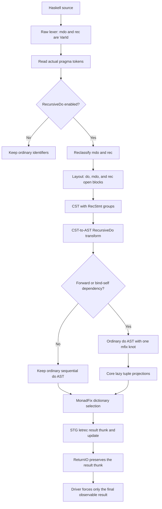

*For God so loved the world, that he gave his only begotten Son, that whosoever believeth in him should not perish, but have everlasting life. — John 3:16 (KJV)*

# RecursiveDo workflow

This workflow keeps `mdo` and `rec` contextual, lowers recursive statement groups before type
inference, and represents the recursive values as one lazy `mfix` knot.

## Invariants

- Strings and ordinary comments never enable an extension.
- Later `NoRecursiveDo` flags override earlier `RecursiveDo` flags.
- RecursiveDo syntax does not add a permanent AST variant after lowering.
- `mdo` prefixes without a forward or bind-self dependency remain sequential.
- The knot tuple is projected lazily; desugaring must not force it before `mfix` produces it.
- ReturnIO preserves its payload thunk; forcing occurs at strict uses or the observable driver
  boundary.
- Existing IO `do` lowering remains on its proven primitive path.

## Landing state

- Frontend contextual keyword, layout, and CST support: implemented.
- CST-to-AST dependency segmentation and knot transform: implemented.
- Lazy Core tuple projections and IO/Maybe/list MonadFix dictionaries: implemented.
- STG letrec knot behavior, lazy ReturnIO payloads, and final-result forcing boundary:
  implemented.
