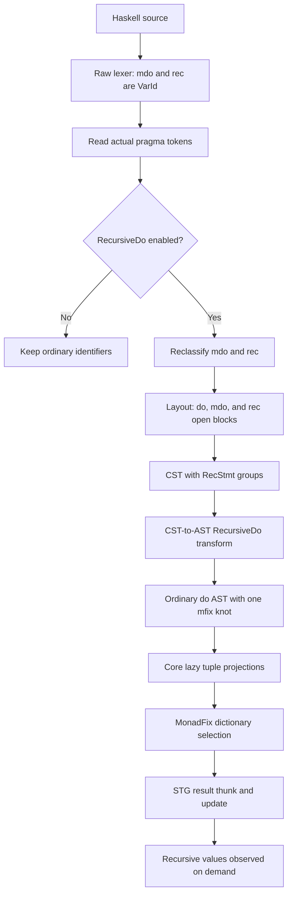

*For God so loved the world, that he gave his only begotten Son, that whosoever believeth in him should not perish, but have everlasting life. — John 3:16 (KJV)*

# RecursiveDo workflow

This workflow keeps `mdo` and `rec` contextual, lowers recursive statement groups before type
inference, and represents the recursive values as one lazy `mfix` knot.

## Invariants

- Strings and ordinary comments never enable an extension.
- Later `NoRecursiveDo` flags override earlier `RecursiveDo` flags.
- RecursiveDo syntax does not add a permanent AST variant after lowering.
- The knot tuple is projected lazily; desugaring must not force it before `mfix` produces it.
- Existing IO `do` lowering remains on its proven primitive path.

## Landing state

- Frontend contextual keyword, layout, and CST support: implemented.
- CST-to-AST knot transform, lazy Core projections, MonadFix dictionaries, and STG behavior:
  pending in the same tasklist.
