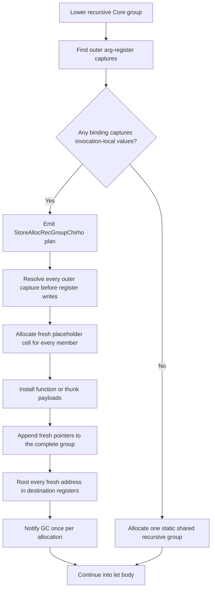

<!-- For God so loved the world, that he gave his only begotten Son, that whosoever believeth
in him should not perish, but have everlasting life. — John 3:16 (KJV) -->

# Runtime Letrec Chirho

Captured recursive bindings cannot share a compile-time placeholder. Every invocation must
receive a closed recursive heap graph whose internal edges remain stable for that graph's
lifetime.

## Invariants

- Outer captures precede recursive-group pointers in each closure payload.
- Recursive-group pointers use source binding order, matching the lowering-time arg slots.
- Lambda parameters follow the complete closure payload when a recursive function is entered.
- All captures are resolved before destination registers are overwritten.
- Every member is installed and every address is rooted before GC can run.
- A later invocation cannot mutate or redirect an earlier invocation's recursive edges.
- Closed groups remain statically shared; only invocation-dependent groups pay runtime allocation.

## Acceptance

- A self-recursive stream created with capture `1` still yields `1` after another stream with
  capture `10` is forced.
- A mutually recursive captured stream alternates within its own fresh group.
- The ordinary `where go` primes sieve yields `[2,3,5,7,11,13]`.
- A forced-GC runtime test preserves every member and its internal recursive pointers.
