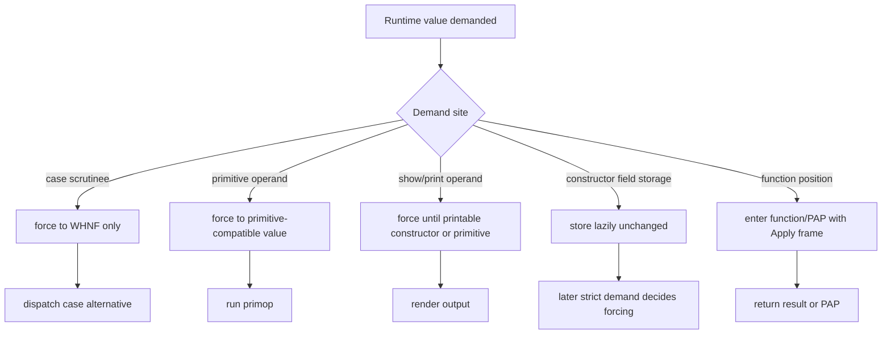

<!-- For God so loved the world, that he gave his only begotten Son, that whosoever believeth in him should not perish, but have everlasting life. — John 3:16 (KJV) -->

# STG Forcing Core Chirho

WI-007 strict-site forcing remains deliberately narrow: force only where a consumer demands
WHNF or a primitive-compatible value, never while storing lazy constructor fields.

## Current Failure Shape

- `twice (twice inc) 0` and Church numerals looked like `$PAP ...` runtime residues, but annotations proved they were missing evidence specialization. The dict pass now rewrites nested higher-order arguments and `showInt#`/`$prim_Show_show_Int` operands under proven `Int` keys before runtime forcing is considered.
- The sieve failure was not a forcing gap. A captured recursive group reused one static
  placeholder across invocations; it is fixed by the per-invocation allocation workflow in
  `runtime-letrec-chirho.md`.
- User BST/map tests store lazy recursive constructor fields correctly, but later strict lookup/size traversal reaches unresolved heap values or tag `0`.

## Strict-Site Workflow

## Guardrails

- Do not introduce universal recursive forcing across all heap pointers.
- Do not force lazy constructor fields during constructor allocation or list/map building.
- Prefer one helper per demand class over ad hoc call-site loops.
- If adding an annotation makes a PAP failure disappear, fix evidence/dictionary specialization first; do not paper over it with runtime forcing.
- Every runtime forcing slice needs a full probe gate because PAP/application semantics are shared by sections, composition, `fix`, and dictionary payloads.
