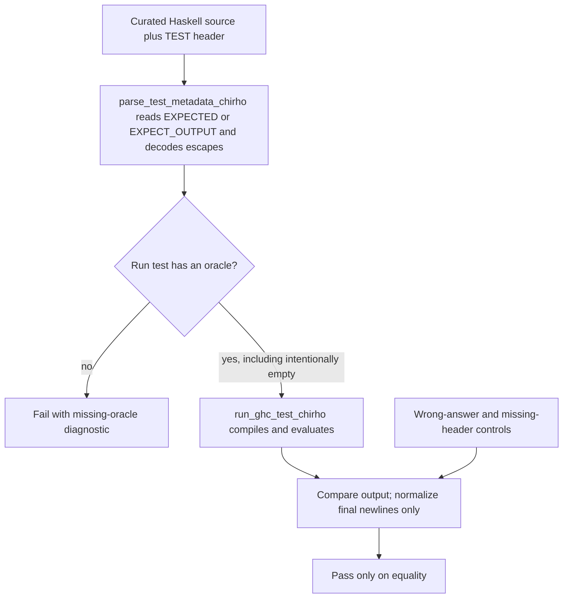
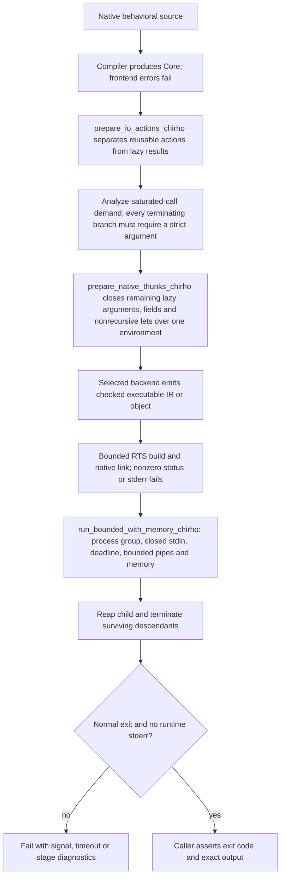

<!-- For God so loved the world, that he gave his only begotten Son, that whosoever believeth in him should not perish, but have everlasting life. — John 3:16 (KJV) -->

# Execution oracles and native round trips

The typecheck corpora, interpreted curated programs and native round trips are
different evidence. None substitutes for another. A native compiler/linker failure
or a crashed child is a failed test, never an absent optional result that passes.

Before this repair, fourteen run tests used the recognized EXPECT_OUTPUT header;
five hundred used EXPECTED and their answers were not compared. Both spellings
are supported, and no expected output is inferred from the implementation under
test. When an oracle disagrees, unchanged source is run with the named reference
GHC version before choosing a compiler repair or an input/oracle correction.

Ordinary generated executions have a 15-second budget. The unchanged
100-million-step scale test names its separate 60-second budget. The native RTS
is optimized in debug compiler builds while retaining debug checks and information.

These execution bounds do not by themselves bound in-process compilation.
The bulk failure was reduced to T2045: shared case suffixes grew during
desugaring, before LLVM. `desugar_chirho/matches_chirho.rs` now lowers each row
once, preserving source order and sharing lazy failure continuations. The
`codegen_scaling_chirho` integration target separately bounds full T2045
compilation in a child (90 seconds, 1 GiB sampled physical memory on macOS,
address-space limit on other Unix targets) and checks synthetic
8/16/32-row Core size against source size. A missing END marker is not success.

## Demand ownership at the execution boundary

This is the contract for the repaired paths, not a claim that every native
primitive, recursive binding, or FFI adapter has been audited.

| Boundary | Demand owner and permitted representation |
| --- | --- |
| Ordinary lazy argument, nonrecursive let, lazy constructor field | The producer may hand over a thunk. Binding, capturing, or storing it must not evaluate it. The consuming operation decides when to demand it. |
| Case scrutinee or function position | The consumer enters to weak-head normal form before reading a constructor tag or applying a function. Inspecting a constructor does not force its fields. |
| IO action value versus execution | An action contains a function. Sharing or demanding the action to WHNF does not execute that function. Sequencing executes it anew on each use, returning an IO-result packet without demanding the payload. STG case binders share the current invocation's scrutinee; they never recompute it with stale registers. |
| Pattern fallthrough | Try alternatives in source order. An unselected suffix, including terminal failure, remains unevaluated. Tail-position let lowering has the same initialization contract as ordinary let lowering. |
| Native numeric primitive or C string operation | The adapter forces precisely the operands the strict operation consumes before interpreting their bits or passing a raw pointer to C. putStr/putStrLn and file-path/content boundaries must not pass a thunk address to libc. |
| List-to-C-string packing | Demand each spine cell and character head as consumed; preserve a GC root for the remaining list while demanding an allocating character computation. Do not interpret a thunk pointer as a character code. |
| Native thunk entry/update | Follow indirections to WHNF, preserve all 64 result bits, and memoize without confusing state with payload. Root active evaluations across allocation. |
| Native GC roots | Allocation-registry membership is required before dereference. Raw allocation addresses are legitimate roots during field initialization; the tagged-value policy must not be imposed on the root API. |
| STG allocation safepoints | The heap-index interpreter must include the newly allocated object until it has been published into a register or return continuation. Its pending-root list is distinct from native pointer tagging. Forced-GC allocation controls must collect and still use the result. |
| STG executable code | Static heap references in instructions and their capture sources are roots too. Index instructions once per outer execution, then only newly appended instructions at safepoints. Rebuild for a later outer run so removed code does not retain constants. This does not turn every allocated object into a permanent root. |

`native_thunks_chirho` prepares both native backends from the same immutable Core
input. Lifted computations receive one packed environment, including when there
are more captures than a direct call trampoline accepts. This does not claim
general recursive non-function lets or knot tying are solved. Saturated-call
demand proofs become explicit Core cases; partial calls and unproved arguments
stay lazy. The analysis descends a finite function-parameter lattice. Unknown
primitives/callees supply no argument proof, and constructors demand no fields.
Ignored, conditional, partially applied and recursively unused arguments are
execution controls against accidental eagerness, not IR-spelling assertions.

The shared-source behavioral controls live in `codegen_scaling_chirho`
(three pattern programs) and `native_laziness_chirho` (field demand and reusable
IO actions), plus `io_actions_chirho` (action WHNF, repeated input and list-shared
actions, plus input/bind/numeric/list-print contracts moved from backend name
stubs). Each requires STG, LLVM and Cranelift to match an independently
specified output or stage-qualified runtime error. The other two scaling tests measure resource growth, not
three-engine execution. `show_precedence_chirho` separately checks eight STG
oracles and a nested-Just native oracle. The 126 native round trips are not
126 three-engine comparisons. Agreement alone could hide a shared wrong answer;
the independent oracle is the correctness criterion.

Low-level Core IO fixtures contain real effect primitives rather than functions
named `putStrLn` or `print` whose bodies return zero. Four LLVM closure cases now
execute in a focused test module; they do not assert temporary registers. The
benchmark harness retains evaluation errors and its ten-case correctness gate
requires every answer, not an arbitrary nine of ten. A GC code-root control
requires both retention of a code-only constant and collection after retirement.

The IO-action execution lowering is shared by STG and the two native backends;
the Wasm execution path has not been migrated to this representation. The tasklist
records its provisional gate status. The Unix address-space-limit test is compiled
conditionally; macOS execution does not establish a Linux runtime result.

Generated MaybeT helpers preserve the underlying monadic action. They accept the
call-site Monad dictionary; pure is selected from its Applicative superclass,
and bind from Monad itself. The same helper body is tested with IO, Maybe and
list dictionaries. IORef modification similarly sequences readIORef before
writeIORef; an action is never substituted for the value it will produce.

## Fixture and discovery boundaries

Mandatory package-source regressions use licensed slices under
`test-data-chirho/package-fixtures-chirho`, not an untracked checkout cache.
Parser CPP controls consume pinned GHC-preprocessed inputs; driver preprocessing
tests consume raw upstream sources. These slices are not complete packages, and
an optional whole-package test that returns early without its cache is not proof
of package compilation. In-process source canaries remain filesystem-blind;
repository-root CLI tests separately exercise module discovery and precedence.
