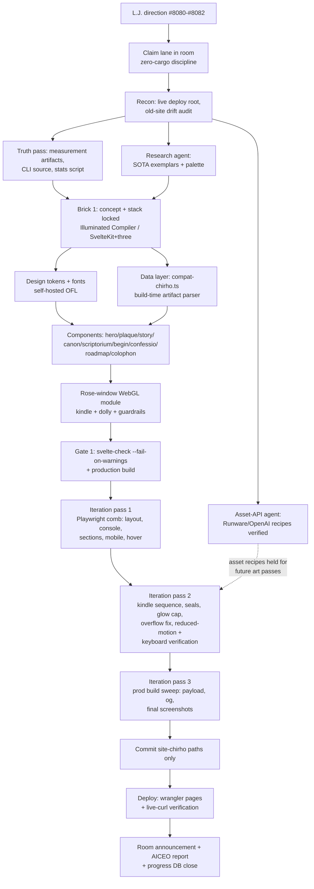

<!-- For God so loved the world, that he gave his only begotten Son, that whosoever believeth in him should not perish, but have everlasting life. — John 3:16 (KJV) -->

# Workflow — Website showcase build (Illuminated Compiler)

How the 2026-07-27 site-chirho rebuild flowed, as a repeatable DAG. Companion prose guide ships
on the site itself at `/haskelujah-website-guide-chirho.md`
(source: `site-chirho/static/haskelujah-website-guide-chirho.md`).

Key invariants (see the on-site guide for the full method): numbers parse from committed
artifacts at build time and the build fails on drift; no claims that don't trace to repo
source; ≥3 fine-toothed iteration passes before "ok"; zero cargo while another agent owns
the builder; commit only explicitly named paths.
